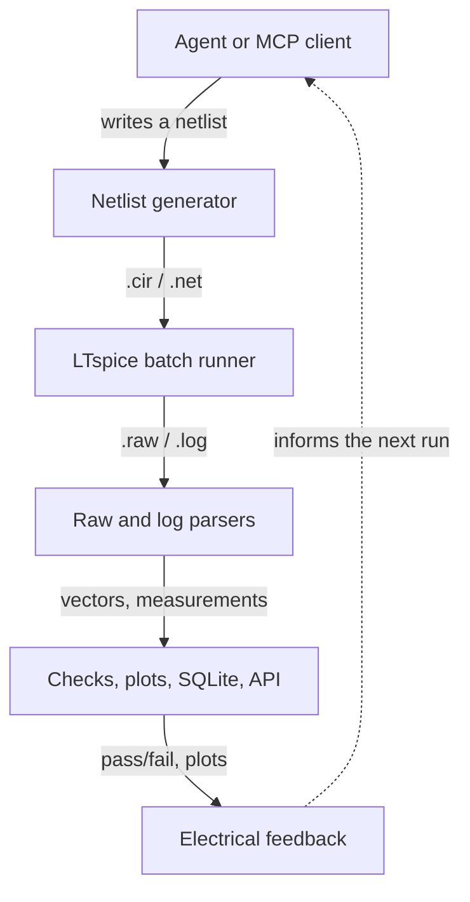

# LTspice Agent Automation

Python-controlled LTspice simulation, analysis, experiment history, and local
MCP and REST automation for agent-driven electronics workflows.

## What this project does

This project turns LTspice into a structured, agent-operated circuit laboratory,
not merely a simulation launcher. An engineer or AI agent can describe an
experiment, run controlled LTspice simulations, recover the waveform and
measurement data, evaluate design requirements, and produce traceable results.

```text
Experiment request → LTspice simulation → structured data → analysis → report
```

Instead of manually changing components, rerunning a schematic, reading plots,
and copying results into notes, an agent can sweep component values and
operating conditions, calculate time- and frequency-domain metrics, identify
failed requirements, and compare a candidate design with an earlier experiment.
The outputs are saved as reproducible JSON, CSV, Markdown, waveform, and run
artifacts so a human can inspect the evidence behind every conclusion.

LTspice remains the trusted circuit-simulation engine. This toolkit supplies
the repeatable execution, data extraction, experiment management, measurement,
comparison, and agent-friendly MCP interface around it. The long-term goal is
to help engineers explore designs, find weak operating corners, detect
regressions, and generate review-ready evidence with far less manual lab work.

**[View this project on claude_projs →](https://claudeprojs.vercel.app/projects/ltspice-agent-automation)**

See [ROADMAP.md](ROADMAP.md) for the approved MCP development sequence,
cross-platform requirements, and portable mixed-signal DAQ/scope flagship.

The project treats text netlists (`.cir`/`.net`) as the reproducible execution
boundary while keeping the tooling useful alongside human-authored LTspice
schematics (`.asc`). It is designed to complement schematic and PCB automation
systems by providing measurable electrical feedback before and during board
design.

## What is included

- Cross-platform Python wrapper around LTspice batch mode
- Binary and ASCII `.raw` waveform parsing, CSV export, and plots
- `.meas` and native `.step` result extraction
- Parameter sweeps, statistical yield analysis, and target-response search
- Durable run and experiment manifests, restart recovery, and a static HTML dashboard
- An MCP server exposing the toolkit as native agent tools
- Local synchronous and asynchronous REST API
- Unit tests and small validation circuits, from a single-pole RC divider up
  to a resonant 2nd-order active filter

The included validation circuits are intentionally simple and generic: an AC
RC low-pass, a transient RC step response, a stepped RC response, a
transistor-level CMOS NAND, and a Sallen-Key 2nd-order active filter. They
validate the API and data pipeline without including any private design or
individual test-run artifacts.



## A first result

A Sallen-Key 2nd-order active low-pass filter, tuned to Q=2, produces
machine-checkable resonant peaking in its frequency response and underdamped
ringing in its step response — dynamics a single-pole RC circuit can't
exercise:


*Generated by `examples/analyze_sallen_key.py`. The same circuit also exists
as a real, GUI-editable LTspice schematic —
[`examples/sallen_key_lowpass.asc`](examples/sallen_key_lowpass.asc) — see
[LEARNINGS.md](LEARNINGS.md#schematic-compatibility) for how it was authored
and verified.*

## Run the example

From this directory:

```bash
python3 ltspice_wrapper.py
```

On macOS, the wrapper looks for the standard executable at:

```text
/Applications/LTspice.app/Contents/MacOS/LTspice
```

Override executable discovery when needed:

```bash
LTSPICE_EXECUTABLE=/path/to/LTspice python3 ltspice_wrapper.py
```

The core runner, parser, API, tests, CSV, JSON, SQLite, and HTML tooling use
only Python's standard library. Install the optional plotting dependency when
needed:

```bash
python3 -m pip install -r requirements.txt
```

Common workflows are also available through `make`: `make test`, `make ac`,
`make transient`, `make nand`, `make sallen-key`, `make mixed-signal-daq`,
`make sweep`, `make statistical-yield`, `make search`, `make step`, and
`make dashboard`.

Each run gets its own timestamped directory under `runs/`. LTspice writes the
simulation results there, including the `.raw` and `.log` files. Scalar `.meas`
results are also extracted from the log and printed. Every run includes a
`run_manifest.json` file containing the command, paths, netlist hash, options,
timing, status, output file list, and SHA-256/size records for generated
artifacts.

## Run an existing netlist

```bash
python3 ltspice_wrapper.py path/to/Draft2.net
```

Use `--output-dir` when a stable output location is preferable:

```bash
python3 ltspice_wrapper.py examples/rc_lowpass.cir --output-dir runs/latest
```

An explicit output directory must not already exist; the wrapper creates it
atomically. This prevents concurrent callers from sharing a directory and an older
RAW or log file from being mistaken for evidence from the current simulation.
Resolvable relative `.include`, `.inc`, and `.lib` references are rewritten in
the staged deck so they retain their source-directory meaning.

Text netlists (`.cir`/`.net`) are the most portable automation boundary. The
wrapper can attempt `.asc` schematics, but older or version-specific schematic
files may require opening in LTspice and exporting/recreating a text netlist
before batch execution.

On macOS, validate the LTspice release itself before debugging the automation
layer. LTspice 26.0.2.1 failed during command-line startup on one Apple Silicon
Mac running macOS Tahoe, while the same wrapper and netlists passed with
LTspice 17.2.4. See [LEARNINGS.md](LEARNINGS.md#ltspice-26-on-macos-tahoe) for
the symptoms and recovery procedure.

For a text-readable raw file, especially for transient analysis:

```bash
python3 ltspice_wrapper.py examples/transient_rc.cir --ascii
```

## Run a parameter sweep

The included sweep varies resistance, runs six independent LTspice jobs, and
writes machine-readable results:

```bash
PYTHONPATH=. python3 examples/sweep_rc.py
```

Each sweep is stored under `runs/sweep-<timestamp>/`, with one `.raw` and `.log`
pair per circuit plus `results.csv` and `results.sqlite3` summaries.
Every sweep is also appended to `runs/history.sqlite3` for cross-run analysis.

## Analyze and plot waveforms

The analysis example parses the binary `.raw` file, exports all vectors to CSV,
creates a PNG frequency-response plot, and runs a pass/fail measurement check:

```bash
PYTHONPATH=. python3 examples/analyze_rc.py
```

See [LEARNINGS.md](LEARNINGS.md) for the verified command behavior, raw-file
format notes, and the current automation roadmap.

Sweep history is stored in SQLite at `runs/history.sqlite3`; the per-sweep
database remains alongside each sweep's CSV summary.

Print the accumulated history with:

```bash
PYTHONPATH=. python3 examples/history_report.py
```

## Analyze transient waveforms

The transient example exports the waveform, plots the output voltage, and
checks both `.meas` values and decoded raw-vector extrema:

```bash
PYTHONPATH=. python3 examples/analyze_transient.py
```

## Run the parser/check tests

```bash
python3 -m unittest discover -s tests -v
```

## Run a production statistical yield analysis

The statistical RC example uses the same production API exposed over MCP. It
creates an immutable 24-sample scrambled-Halton plan with bounded Gaussian R/C
populations, runs one LTspice simulation per paired sample, evaluates a gain
window, and generates statistics, worst-case, sensitivity, CSV/JSON evidence,
and the offline HTML report. It does not maintain a second random sampler or
private SQLite schema:

```bash
PYTHONPATH=. python3 examples/statistical_rc_yield.py
```

### Resource ceilings

The production path rejects oversized work before it can become trusted
evidence: at most 1,000 statistical samples or expanded experiment points, 32
variables, 4 workers, 32 waveform analyses, and 256 requirements are accepted.
Each LTspice process has a 3,600-second maximum timeout. RAW parsing is limited
to 256 MiB, log parsing to 64 MiB, and generated artifacts from one accepted
run to 512 MiB. A successful process whose artifacts exceed that final ceiling
is recorded as failed before hashing or cache publication; cache entries over
the same ceiling fail integrity validation. The artifact ceiling is a
post-process acceptance guard, not an operating-system disk quota.

Offline reports embed at most 100 traces, 40,000 displayed waveform points, and
2,000 statistical analysis rows. Empirical CSV imports are separately limited
to 1 MB and 10,000 observations. These are validation limits, so malformed or
oversized studies cannot prevent the rebuildable index and dashboard from
isolating and reporting other valid experiments.

## Run the CMOS NAND experiment

The NAND experiment drives a transistor-level 3.3 V CMOS NAND gate through all
four input combinations, compares its output against a behavioral reference,
and measures propagation delay:

```bash
PYTHONPATH=. python3 examples/analyze_nand.py
```

It writes a waveform CSV, transient plot, measurements, and manifest below
`runs/`. The generated artifacts are intentionally ignored by Git.

## Run the Sallen-Key filter example

The Sallen-Key example runs both an AC sweep and a step response for a
2nd-order active low-pass filter (ideal op-amp modeled as a fixed-gain
E-source, K=2.5, Q=2), checks the resonant peaking and overshoot against
closed-form predictions, and plots both domains:

```bash
PYTHONPATH=. python3 examples/analyze_sallen_key.py
```

The same circuit also ships as a real LTspice schematic —
[`examples/sallen_key_lowpass.asc`](examples/sallen_key_lowpass.asc) and
[`examples/sallen_key_step.asc`](examples/sallen_key_step.asc) — open either
in LTspice to view or edit it graphically. Simulation still runs from the
`.cir` netlist; see [LEARNINGS.md](LEARNINGS.md#schematic-compatibility) for
why `.asc` files aren't batched directly.


*`examples/sallen_key_lowpass.asc` open in the actual LTspice editor — hand-authored
from LTspice's own symbol library and pin geometry, not a drawing.*

## Run the mixed-signal DAQ acquisition study

The portable-DAQ reference is a materially richer validation circuit than the
Sallen-Key filter. It combines a two-pole 1 MHz-class anti-alias path, gain and
output loading, a clocked analog switch, hold capacitor, ADC input capacitance,
and leakage. One immutable correlated scrambled-Halton plan drives both AC and
transient studies across named light/heavy ADC-load corners:

```bash
PYTHONPATH=. python3 examples/mixed_signal_daq_study.py
# or
make mixed-signal-daq
```

The AC contract checks passband gain, cutoff, and peaking. The transient
contract checks front-end settling, full-resolution track error, and hold
droop. Each run emits yield, Wilson intervals, worst evidenced cases, global
sensitivity, and interactive offline HTML. The DAQ reports place the schematic,
plain-language circuit and simulation context, and interactive plots first;
compact engineering units replace raw scientific notation, while complete
parameters and evidence remain in a collapsed appendix. The companion
`mixed_signal_daq_boundary.cir` isolates track duration so an adaptive study
can resolve the real pass/fail acquisition-time boundary without conflating
other tolerances.

Open [`examples/mixed_signal_daq.asc`](examples/mixed_signal_daq.asc) in
LTspice for the human-facing version of the acquisition channel. It uses stock
LTspice symbols, labeled functional blocks and nets, nominal parameter values,
and notes explaining the filter, buffer, ADC driver, sample/hold, ADC loading,
droop, and acquisition-error observer. The active schematic is the nominal
transient profile; a note identifies the source and clock changes used by the
companion AC study. Automation continues to run the `.cir` templates, and a
regression test keeps the schematic component/value inventory aligned with the
transient netlist.

## Search for a target response

The design-search example uses a logarithmic binary search to select resistance
for a target gain, preserving every trial as CSV, SQLite, PNG, and HTML:

```bash
PYTHONPATH=. python3 examples/design_search_rc.py
```

## Build a run dashboard

Index all runs that have manifests into static HTML and JSON:

```bash
python3 report_runs.py
```

Open [runs/index.html](runs/index.html) to browse statuses, measurements,
durations, and generated artifacts.

## Use native LTspice stepping

Native `.step` runs multiple parameter points in one LTspice invocation:

```bash
PYTHONPATH=. python3 examples/analyze_step_rc.py
```

The example detects step boundaries in the raw axis, parses the stepped
measurement table, and writes one CSV row per native step.

## Use the local REST API

Start the service in one terminal:

```bash
PYTHONPATH=. python3 api_server.py
```

Submit a netlist from another terminal:

```bash
PYTHONPATH=. python3 examples/api_client.py
```

Submit a longer transient job asynchronously and poll it:

```bash
PYTHONPATH=. python3 examples/api_async_client.py
```

The service exposes `GET /health`, `GET /runs`, `GET /jobs`, `GET /jobs/{job_id}`,
`POST /simulate`, and `POST /simulate/async`. The simulation endpoint accepts
JSON containing `netlist`, optional `filename`, optional `ascii`, and optional
`timeout`. The async endpoint returns a job ID immediately; poll its job URL
until the status is `completed` or `failed`. It binds to `127.0.0.1` by
default. The current server accepts only numeric `127.0.0.1`; an authenticated
network mode is intentionally outside this local bridge.

## Use the MCP server

`mcp_server.py` exposes the same automation surface as native tools over the
Model Context Protocol, in-process (no REST server needed): `run_netlist`,
`run_netlist_file`, `get_measurements`, `get_waveform`, `export_waveform_csv`,
`analyze_waveform`, `run_parameter_sweep`, `run_experiment`,
`generate_statistical_plan`, `get_statistical_plan`, `run_statistical_experiment`,
`define_experiment`, `define_statistical_study`, `start_experiment`, `get_experiment`,
`cancel_experiment`, `compare_experiments`, `build_experiment_index`,
`query_experiments`, `summarize_statistical_experiment`,
`analyze_statistical_worst_cases`,
`analyze_statistical_sensitivity`,
`define_local_sensitivity_study`, `analyze_local_sensitivity`,
`define_adaptive_boundary_study`, `advance_adaptive_boundary_study`,
`get_adaptive_boundary_study`,
`compare_statistical_experiments`,
`build_experiment_report`, `build_comparison_report`,
`build_experiment_dashboard`, `list_runs`, `build_dashboard`, and
`list_examples`.

It depends on the `mcp` package. Homebrew/system Python is externally
managed, so install it into a local virtualenv:

```bash
python3 -m venv .venv
.venv/bin/pip install -r requirements-mcp.txt
```

Register it with Claude Code:

```bash
claude mcp add ltspice -- "$(pwd)/.venv/bin/python" "$(pwd)/mcp_server.py"
```

Or run it directly for any stdio MCP client:

```bash
.venv/bin/python mcp_server.py
```

Every run tool returns a `run_dir`; pass it to `get_measurements`,
`get_waveform`, or `export_waveform_csv` to pull results without re-running
the simulation. `get_waveform` downsamples by default (`max_points=200`) to
keep vectors small in an agent's context and always retains both endpoints;
responses are capped at 10,000 points. Use `export_waveform_csv` for full
resolution. This server has the same
trust model as the REST API: it runs LTspice locally with no sandboxing, so
only expose it to trusted agents.

### Run a structured experiment

Phase 2A adds synchronous, deterministic Cartesian experiments. Parameters are
ordered records; declaration order is significant, each value order is
preserved, and the first parameter changes slowest. Units are metadata only and
do not modify the rendered value. A parameter named `R` replaces every `{R}`
placeholder in the netlist template.

```json
{
  "netlist_template": "R1 in out {R}\nC1 out 0 {C}\n.ac dec 100 10 1Meg\n.end\n",
  "parameters": [
    {"name": "R", "values": ["1k", "2.2k"], "unit": "ohm"},
    {"name": "C", "values": ["10n", "22n"], "unit": "F"}
  ],
  "waveform_analyses": [
    {
      "name": "bandwidth",
      "variable": "V(out)",
      "requirements": [
        {"metric": "cutoff_frequency", "operator": ">=", "target": 1000,
         "reference_frequency": 10}
      ]
    }
  ]
}
```

Phase 2B-A adds optional derived parameters without evaluating Python or shell
expressions. Dependencies come from placeholders in each derived `template`,
are resolved in stable topological order, and do not increase the Cartesian
point count. Base parameters may be used only through a derived parameter:

```json
"derived_parameters": [
  {"name": "RC", "template": "({R})*({C})", "unit": "s"},
  {"name": "DOUBLE_RC", "template": "2*{RC}", "unit": "s"}
]
```

Forward references are allowed. Unknown dependencies, duplicate names, cycles,
and parameters that cannot affect the netlist are rejected before LTspice runs.
Returned point parameters and CSV columns contain resolved derived strings in
their original declaration order.

### Generate a deterministic statistical plan

Phase 3A separates sampling from simulation. Call `generate_statistical_plan`
with a seed and bounded variables to create an immutable, content-addressed
plan under `runs/statistical-plans/` without invoking LTspice:

```json
{
  "variables": [
    {"name": "R", "distribution": "gaussian", "minimum": 9000,
     "maximum": 11000, "nominal": 10000, "sigma": 500, "unit": "ohm"},
    {"name": "C", "distribution": "uniform", "minimum": 0.0000009,
     "maximum": 0.0000011, "nominal": 0.000001, "unit": "F"},
    {"name": "GAIN", "distribution": "discrete",
     "values": ["0.9", "1", "1.1"], "weights": [1, 3, 1], "nominal": "1"}
  ],
  "sample_count": 24,
  "seed": 20260824
}
```

The versioned SHA-256 counter generator gives each `(seed, sample, variable)`
an independent deterministic draw. Reordering unrelated variables or resuming
later cannot consume a different random stream. Uniform definitions retain the
Phase 3A-1 generator and artifact bytes. Mixed plans use the versioned Phase
3A-2 distribution generator.

Bounded Gaussian variables require `nominal`, positive `sigma`, `minimum`, and
`maximum`; the bounds must span at least 0.1 sigma. A fixed Decimal
Marsaglia-polar transform rejects out-of-bound draws with a hard 4,096-attempt
limit. Discrete variables require ordered unique string `values` and matching
positive finite `weights`. Weights are normalized canonically, and an exact
cumulative boundary selects the next bin. Plans are limited to 1,000 samples,
32 variables, and 10,000 generated values.

Phase 3C-1 adds optional correlated Gaussian groups. Each group names at least
two Gaussian variables and supplies a matching correlation matrix:

```json
"correlations": [
  {
    "variables": ["R1", "R2"],
    "matrix": [[1, 0.8], [0.8, 1]]
  }
]
```

Matrices must be finite, symmetric, positive semidefinite, have unit diagonal,
and contain coefficients from -1 through 1. A variable may belong to only one
group. Group variables and matrices are canonicalized by variable name, so an
equivalent reordered definition produces the same named samples. The versioned
Decimal Cholesky transform redraws the complete group whenever any bounded
component is rejected; it never clips individual values or weakens the declared
relationship. Existing uncorrelated Phase 3A plans and artifact hashes remain
unchanged.

Phase 3C-2 adds empirical variables for resampling observed component
populations. Supply either inline numeric observations:

```json
{"name": "R", "distribution": "empirical",
 "values": [9980, 10020, 10075, 9950], "unit": "ohm"}
```

or a UTF-8 CSV path confined to this project and a numeric column:

```json
{"name": "R", "distribution": "empirical",
 "csv_path": "examples/illustrative_component_population.csv",
 "column": "resistance_ohm", "unit": "ohm"}
```

Sampling is deterministic with replacement and preserves duplicate
observations, so repeated measured values retain their empirical frequency.
The immutable plan freezes the canonical observations along with source kind,
SHA-256, observation count, resampling method, and CSV path/column when
applicable. Editing or removing a CSV after plan generation cannot change a
saved study; regenerating from changed bytes produces different provenance and
a different content-addressed plan. CSV input is bounded to 1 MB, 10,000 rows,
and 256 columns. Missing, blank, nonnumeric, nonfinite, malformed, escaped, and
symlinked inputs fail before a plan is written. Units remain metadata and are
never converted implicitly. Empirical variables cannot be placed in the
Gaussian correlation groups described above.

The bundled CSV is an illustrative test population, not claimed laboratory
data. Replace it with measured lot characterization or another traceable source
when drawing engineering conclusions.

Phase 3C-3 crosses every statistical sample with finite named operating-corner
axes. Each axis controls one netlist placeholder and declares ordered named
values:

```json
"corner_axes": [
  {
    "name": "temperature",
    "parameter": "TEMP",
    "unit": "degC",
    "values": [
      {"name": "cold", "value": -40},
      {"name": "room", "value": 27},
      {"name": "hot", "value": 125}
    ]
  },
  {
    "name": "device_model",
    "parameter": "MODEL",
    "values": [
      {"name": "slow", "value": "DIODE_SLOW"},
      {"name": "fast", "value": "DIODE_FAST"}
    ]
  }
],
"corner_aggregate": false
```

Corner values are finite single SPICE tokens, so axes can select temperature,
supply, load, or a predeclared device-model name without injecting directives.
Axis and value declaration order defines a deterministic Cartesian corner set;
samples are the outer ordering and corners vary inside each sample. Axis
parameters must be unique and cannot collide with statistical variables. Plans
are limited to eight axes, sixteen values per axis, 1,000 expanded points, and
10,000 total parameter cells before any simulation is scheduled.

Every expanded point records its base sample ordinal and named corners. That
metadata is frozen into synchronous and durable experiment definitions and
survives checkpoint/resume. `statistics.json`, `statistics.csv`, the MCP
summary, and the offline report always expose each corner combination
separately. The overall yield is deliberately absent unless
`corner_aggregate` is explicitly `true`, in which case a clearly labeled
pooled yield is added without replacing the per-corner results.

Phase 3C-4 adds deterministic space-filling alternatives to independent random
sampling. Set `sampling_method` when generating a plan:

```json
{
  "variables": [
    {"name": "R", "distribution": "uniform", "minimum": 9000,
     "maximum": 11000, "nominal": 10000, "unit": "ohm"},
    {"name": "C", "distribution": "empirical",
     "values": [9.8e-9, 10e-9, 10.2e-9], "unit": "F"}
  ],
  "sample_count": 16,
  "seed": 20260824,
  "sampling_method": "latin_hypercube"
}
```

`latin_hypercube` uses every one-dimensional stratum exactly once, with a
seeded permutation and deterministic within-stratum jitter for each variable.
`halton` uses stable prime dimensions, deterministic digit scrambling, and a
seeded shift. Variable names determine their streams and Halton dimensions, so
reordering declarations does not redraw an existing named variable. Uniform
variables use the resulting fraction directly; weighted-discrete and empirical
variables use inverse-CDF selection. Named corners still expand after sampling
and therefore preserve the same sample-major evidence mapping.

Omitting `sampling_method`, or setting it to `independent`, preserves all prior
generator versions and artifact bytes. The versioned stratified generator is
`sha256-stratified-halton-v6`. Phase 3C-5A adds bounded and correlated Gaussian
support under `sha256-stratified-gaussian-v7`. Uncorrelated values map each
space-filling coordinate through a deterministic Decimal truncated-normal CDF.
Correlated groups stratify independent latent-normal coordinates before the
existing Decimal Cholesky transform. If a correlated vector exceeds any bound,
the whole vector is deterministically rejected and redrawn; individual values
are never clipped and the declared matrix is never altered. The Latin-hypercube
guarantee therefore applies exactly to uncorrelated truncated-Gaussian
probability strata and to the initial latent coordinates of correlated groups.
Native LTspice stepping is not used; each planned point keeps its own log, RAW
file, measurements, and requirement evidence.

Use `get_statistical_plan` to verify and inspect an existing plan. Pass its
`plan_id` plus an ordinary netlist template to `run_statistical_experiment`:

```json
{
  "plan_id": "statistical-plan-0123456789abcdef",
  "netlist_template": "* Statistical RC study\nR1 in out {R}\nC1 out 0 {C}\n.ac dec 100 10 1Meg\n.end\n"
}
```

Statistical values stay paired by sample ordinal: 24 R/C samples execute as 24
independent Phase 2 points, not a 24-by-24 Cartesian grid. The resulting
manifest records the source plan hash and remains compatible with the existing
results, CSV, index, comparison, and offline-report validators.

### Run a durable statistical yield study

Call `define_statistical_study` with a verified `plan_id`, netlist template,
waveform requirements, and optional `max_concurrency`. It freezes the plan's
ordered points inside the hashed durable experiment definition. Use the same
`start_experiment`, `get_experiment`, and `cancel_experiment` lifecycle as an
ordinary Phase 2 job. A restart resumes only missing point checkpoints and
never draws replacement samples or reloads the sampler.

After the job completes or is cancelled,
`summarize_statistical_experiment` writes bounded `statistics.json` and
`statistics.csv` artifacts. Statistics schema v2 carries the same validated
`sampling_provenance` through JSON, flat CSV provenance rows, and the MCP
summary: method, generator version, plan ID, plan SHA-256, durable-definition
SHA-256, and the runs-relative immutable plan path. Durable resume returns that
frozen provenance instead of reconstructing it from current sampler code.
Legacy studies without an explicit method are identified as independent
sampling.

Observed yield is electrical
passes divided by electrically evaluated samples. Simulation errors, waveform
analysis errors, and cancelled samples are reported separately and excluded
from that denominator; `planned_pass_fraction` also shows passes divided by
the full planned population. The summary includes a Wilson 95% binomial
interval, mean, sample standard deviation, 5th/50th/95th percentiles,
requirement-margin statistics, contributing point ordinals, and exact failed
sample evidence.

For completed jobs, `build_experiment_report` detects statistical studies
automatically and adds yield, confidence, error-accounting, and failed-sample
sections while linking the JSON and CSV evidence. Its Sampling provenance panel
names the method and generator, displays both frozen hashes, and links directly
to the immutable statistical-plan artifact. It also regenerates validated
worst-case and global-rank-sensitivity artifacts, presents bounded distribution
summaries, and links every analysis JSON/CSV file. Local OAT studies receive a
ranked tornado-data section with incomplete perturbations left explicit. These
tables are display views of the structured evidence, not alternate sources of
electrical truth. For transient studies on LTspice, request `ascii_raw=true`;
AC studies should retain binary RAW so complex waveforms are preserved.

The final Phase 3C verification combines these contracts in one reproducible
study: correlated bounded-Gaussian resistors, empirical capacitor observations,
scrambled Halton sampling, and three named load corners. A real eight-sample
Sallen-Key run completed all 24 analyses with no invalid points. The light and
nominal loads passed 8/8 independently, while the deliberately weak 1 kOhm load
failed 8/8 only on the 7.6 dB low-frequency gain floor (observed
7.5356–7.5357 dB); no aggregate yield was reported because pooling was not
requested.
A byte-stable 128-sample fixture separately verifies the requested 0.8
correlation, repeated-observation empirical frequencies, sample-major corner
ordering, immutable reload, and durable-resume provenance on macOS and Windows.

### Rank worst evidenced statistical cases

Call `analyze_statistical_worst_cases` with a terminal statistical experiment
ID. It performs no simulations and writes portable `worst_cases.json` and
`worst_cases.csv` artifacts from the already validated requirement results.
Each requirement is ranked independently by ascending signed margin, so values
with different metrics or units are never compared. Dense ranks preserve exact
ties, and a nominal top-25 sample bound expands only when needed to retain every
tie at the cutoff. Named corners are ranked by their worst observed margin for
that same requirement; declared corners with no evaluated evidence remain
visible with a null rank instead of disappearing.

Every sample row retains its point ordinal, base sample ordinal, resolved
parameters, named corners, measured value, signed margin, pass/fail result, and
runs-relative evidence path. Invalid, cancelled, and unfinished points are
counted but excluded from electrical rankings. This is an observed-evidence
ranking, not a prediction beyond the simulated population.
The canonical experiment validator rejects duplicate intrinsic requirement
identities, so ordinal copies of an otherwise identical check are not treated
as separate requirements.

### Rank global statistical sensitivity

Call `analyze_statistical_sensitivity` with a terminal statistical experiment
ID. It writes individually atomic `sensitivity.json` and `sensitivity.csv`
artifacts without rerunning LTspice. For every requirement and sampled variable,
it computes Spearman's rank correlation between the variable and signed
requirement margin. Average ranks preserve exact ties. Positive correlation
means increasing the variable tends to improve margin; negative correlation
means it tends to consume margin.

Named corners are analyzed independently and are never pooled implicitly. A
coefficient requires at least five evaluated samples and variation in both the
input and response. Otherwise the row explicitly reports
`insufficient_samples`, `constant_input`, `constant_response`, or
`non_numeric_input`. An absolute coefficient of at least 0.5 is labeled
meaningfully monotonic; lower values remain visible as weak or negligible
associations rather than being discarded.

These coefficients are descriptive associations, not causal effects or design
derivatives. The artifacts name correlated sampled inputs beside each result,
because two correlated components can both rank highly even when the study
cannot isolate their independent influence. Controlled local perturbations are
handled separately by Phase 3D-C.

### Run controlled local sensitivity studies

Call `define_local_sensitivity_study` with a completed statistical experiment,
one electrically evaluated point index, and a relative step. The tool freezes a
content-addressed plan containing the selected baseline and one low/high pair
for every nonzero numeric sampled variable. Named-corner parameters remain
fixed, while categorical and zero-baseline variables are retained as explicit
skip records. Start and monitor the returned experiment with the normal durable
`start_experiment` and `get_experiment` tools, including cancellation and
resume support.

After the study reaches a terminal state, `analyze_local_sensitivity` writes
individually atomic `tornado.json` and `tornado.csv` artifacts. Every
requirement-variable row contains the baseline, low, and high input values;
their units and signed requirement margins; low/high effects and slopes; impact
rank; and direct point-evidence paths. Missing perturbation results remain
visible as incomplete and are never ranked.

Tornado impact is the larger absolute margin change from the baseline. This is
a controlled local response around one evidenced point, not a population-wide
importance claim. Compare it with global rank sensitivity rather than using
one as a substitute for the other.

### Refine an observed pass/fail boundary

Call `define_adaptive_boundary_study` with two completed source points, one
requirement `check_id`, and the single numeric parameter to refine. The points
must differ only in that parameter and must have opposite electrical outcomes
for the selected requirement. This keeps the task to evidenced,
one-dimensional boundary characterization rather than circuit optimization.

Each `advance_adaptive_boundary_study` call either incorporates a completed
child batch or starts the next deterministic batch of evenly spaced interior
values. Poll the returned `active_experiment_id` with `get_experiment`, then
advance again when it is terminal. `get_adaptive_boundary_study` inspects the
parent without changing it. The content-addressed parent manifest records every
child experiment, input, signed margin, evidence path, bracket, width, shrink
ratio, and cumulative sample count, so a restart resumes at a batch boundary.

The study stops at its input tolerance, sample budget, or numeric resolution.
It fails closed if child evidence is incomplete or reveals more than one
pass/fail transition. Adaptively selected points do not update Wilson yield
confidence: they resolve a local boundary and are not an unbiased population
sample.

### Run a durable experiment job

The Phase 2B lifecycle keeps definition and execution separate. First call
`define_experiment` with the same definition accepted by `run_experiment`, plus
an optional `execution_mode` of `"independent"` or `"native"`. Independent mode
accepts `max_concurrency` from 1 through 4; native mode always uses one stepped
LTspice process. Definition validates and persists the experiment but does not
launch LTspice. Then call
`start_experiment` with the returned `experiment_id`, and poll
`get_experiment` for `finished_points`, `pending_points`, `running_points`, and
the existing pass/error counts.

Experiment definitions, progress, and terminal checkpoints are stored as atomic
UTF-8 JSON. A restarted MCP manager automatically requeues jobs that were queued
or running. Independent mode skips valid `point_result.json` checkpoints and
places interrupted points in fresh attempt directories. Native mode treats the
validated batch as one recovery unit: it atomically writes
`native-batch/batch_result.json` before materializing ordered point checkpoints.
If that batch checkpoint is absent after an interruption, the complete stepped
deck is retried in a fresh attempt; a valid checkpoint is recovered without
rerunning LTspice. Final JSON and CSV are always assembled in Cartesian order.

`cancel_experiment` is idempotent and cooperative. It immediately cancels a
defined or queued job. For a running job it prevents new points from being
scheduled; already-running LTspice processes are allowed to finish so behavior
does not depend on Unix signals and remains portable to Windows. If cancellation
arrives before waveform analysis, that analysis is skipped. For native mode,
the one in-flight LTspice process is also allowed to finish; any fully validated
batch evidence is checkpointed before the terminal experiment is marked
`cancelled`. Partial or completed simulation evidence therefore remains
available without platform-specific process signals.

The file-backed manager intentionally supports one active MCP process per
`runs/` directory. Experiments are coordinated FIFO, while points within the
active experiment use the declared concurrency bound. Multi-process locking is
outside Phase 2B.

The portable experiment implementation lives in `experiment_engine.py`. It
owns definition validation, parameter expansion, durable state, checkpoints,
and result assembly without importing MCP. `mcp_server.py` provides the thin
LTspice execution and waveform-analysis adapter plus the public tool wrappers.
This boundary lets other Python front ends reuse the engine without running an
MCP server.

### Compare completed experiments

Phase 2C-A adds `compare_experiments`, a read-only comparison of two completed
experiment IDs. It reads their existing `results.json` artifacts and never
runs LTspice. Points match only when their complete parameter maps match
exactly, including derived values: parameter key order is irrelevant, but
value text is case-sensitive and is not normalized (`1k` and `1000` differ).

The result reports matched, added, and removed points and measurements;
measurement deltas are `candidate - baseline`. Requirements match by analysis
name, metric, threshold, unit, and metric parameters. A passing baseline check
that fails in the candidate is a regression; the reverse is an improvement.
Added and removed checks remain explicit rather than being inferred.

Each comparison is content-addressed from both experiment IDs and both result
file hashes. Repeating an unchanged comparison returns the same ID and rewrites
the same deterministic UTF-8 artifacts under
`runs/comparisons/comparison-<id>/comparison.json` and `comparison.md`.
Malformed, unfinished, ambiguous, or non-finite inputs are rejected before an
output directory is created.

`compare_statistical_experiments` adds a statistical evidence contract. Both
studies must share the same normalized population, corner, parameter-unit, and
electrical-analysis definitions. A shared immutable plan enables exact
point-by-point classification transitions. Different compatible plans are
compared only as unpaired population summaries; if both the circuit and sample
plan change, attribution is explicitly labeled confounded.

The content-addressed comparison records circuit and plan hashes, aggregate and
per-corner yield/interval evidence, requirement-margin distribution deltas,
invalid counts, and paired classification transitions in JSON and CSV. Its
offline `report.html` links both source results. Missing electrical margins due
to simulation or analysis errors remain null rather than becoming fabricated
deltas. The comparison never reruns LTspice.

### Build and query the experiment index

Phase 2C-C1 adds a rebuildable SQLite catalog at
`runs/experiments.sqlite3`. Call `build_experiment_index` to scan existing
`experiment_manifest.json` and terminal `results.json` artifacts. The index
stores experiment summaries, declared parameters, materialized point values,
measurements, and requirement results. It never runs LTspice and is not an
authoritative result store; deleting and rebuilding it leaves the source
artifacts unchanged.

The builder supports both synchronous schema-v1 experiments and durable
schema-v2 jobs. Artifact paths stored in SQLite are relative to `runs/`, so a
copied experiment tree does not retain machine-specific macOS or Windows
paths. A malformed manifest is reported and skipped. A valid manifest with
invalid terminal results remains discoverable with `index_state` set to
`invalid_results`, but no untrusted point data is indexed. The complete staged
database is integrity-checked, closed, and atomically replaces the previous
index; a fatal build or replacement error leaves the prior database intact.

`query_experiments` supports deterministic pagination and optional exact
filters for status, execution mode, pass/fail state, parameter values, circuit
SHA-256, statistical-study status, aggregate yield or confidence floor, sampled
variable, requirement metric, and named-corner values.
Multiple parameter filters must occur together on the same materialized point;
values remain case-sensitive LTspice text, so `1k` and `1000` are distinct.
When yield or confidence is combined with corner filters, all requested corner
values and thresholds must match one corner result; an intentionally unpooled
study never acquires an invented aggregate. Query responses include circuit and
sampling metadata, aggregate and per-corner summaries, sampled variable names,
declared parameters, measurement names, and requirement metrics. Full point
data remains in the linked structured artifacts. The searchable dashboard uses
the same rebuilt index and shows the sampling method plus aggregate or
per-corner yield.

### Run a deterministic coarse optimization

Phase 4A adds a circuit-independent coarse optimizer without adding another
simulation runner. `generate_optimization_plan` freezes continuous grids,
explicit preferred-value-series choices, fixed parameters, named corners,
metric objectives, and hard constraints in a content-addressed JSON plan.
`run_optimization_experiment` sends that plan through the existing independent
experiment engine. Run each required analysis from the same plan, then call
`evaluate_optimization_study` with the completed experiment IDs.

The evaluator verifies every point and parameter map against the immutable
plan, uses the worst named-corner value for each objective and constraint,
keeps simulation/analysis errors separate from electrical failures, computes
the feasible Pareto front, and selects one candidate with the versioned
equal-weight normalized-regret policy. Deterministic JSON, CSV, and a portable
human-first Pareto report are written below `runs/optimization-studies/`.

Run the bounded mixed-signal DAQ qualification with:

```bash
PYTHONPATH=. .venv/bin/python examples/optimize_mixed_signal_daq.py
```

The first study evaluates 16 component/driver candidates at light and heavy
ADC-load corners in both AC and transient LTspice runs. Its competing
objectives are lower 10 MHz alias gain and faster acquisition settling;
passband gain, bandwidth, peaking, tracking error, and hold droop remain hard
constraints. A coarse nominal winner is not a manufacturing-yield proof:
Phase 4D reuses the Phase 3 corner and Monte Carlo machinery for finalists.

### Build a portable experiment report

Call `build_experiment_report` with a completed experiment ID to write a
self-contained `report.html` beside that experiment's structured artifacts.
The report opens directly from disk without a web server or CDN. Its default
layout leads with a brief experiment explanation and interactive SVG waveform
overlays, summarizes parameter ranges in engineering units, and keeps complete
point, requirement, provenance, JSON, CSV, and RAW evidence in a collapsed
appendix. The waveform cursor uses a separate responsive inspector with
two-axis crosshairs and a selected-trace marker. Drag horizontally to zoom;
use Reset zoom or double-click the plot to restore its full domain. Callers may
supply bounded `report_context` text plus a repository-
local PNG/JPEG schematic; that context is persisted as `report_context.json`
so later report rebuilds remain deterministic. Existing callers receive a
generic human-readable summary without changing their API usage.

Waveforms are parsed from the existing RAW evidence without rerunning LTspice.
Each trace is sliced to its validated native or independent step before a
bounded, endpoint-preserving display sample is embedded in the report. The
requirement engine's full-resolution result remains authoritative, and the
report links relatively to `results.json`, `results.csv`, the manifest, and
the original RAW file. Relative links and Windows/POSIX path normalization let
the complete experiment directory move between machines.

The builder rejects incomplete or inconsistent experiments, missing or
escaped RAW artifacts, invalid step mappings, non-finite plot data, and
oversized display payloads before replacing an existing report. User-provided
labels and values are escaped in both HTML and embedded JSON.

Phase 2D applies the same canonical manifest/results validation to indexing,
individual reports, and comparisons. Schema-v2 definition hashes are
recomputed, aggregate pass/fail counts are derived from points, and new
waveform analyses bind their RAW evidence by SHA-256 and byte size. Reports use
extrema-preserving display sampling so narrow glitches found by full-resolution
analysis remain visible; the structured JSON, RAW, and CSV artifacts remain
authoritative.

### Visualize comparisons and browse experiments

Phase 2C-C3 adds two derived, human-facing views while keeping JSON, CSV, RAW,
and SQLite artifacts authoritative. Call `build_comparison_report` with a
baseline and candidate experiment ID to produce a portable
`runs/comparisons/comparison-<id>/comparison.html`. The report overlays the
experiments' actual RAW waveform traces through the same validated parser and
bounded SVG renderer used by individual experiment reports. It also presents
candidate-minus-baseline measurement deltas and marks requirement regressions,
improvements, additions, removals, and unchanged checks.

Call `build_experiment_dashboard` to rebuild `runs/experiments.sqlite3` and
write `runs/dashboard.html`. The offline dashboard lists structured
experiments newest-first, supports text, status, and execution-mode filters,
and links relatively to available manifests, results, reports, and comparison
artifacts. It requires no web server or external JavaScript. Invalid experiment
artifacts remain visible through index diagnostics, while malformed comparison
artifacts are counted and skipped so one damaged result cannot prevent the
dashboard from being generated.

Both builders validate that inputs and outputs remain under `runs/`, normalize
portable Windows/POSIX artifact references, escape embedded content, enforce
display limits, and publish HTML atomically. They never rerun LTspice.

### Reuse verified simulation artifacts

Phase 2C-B1 adds an opt-in simulation cache to `run_netlist`,
`run_netlist_file`, `run_parameter_sweep`, `run_experiment`, and
`define_experiment`. Set `reuse_cache` to `true` to reuse a previously completed
LTspice simulation when its complete cache identity still matches:

```json
{
  "netlist": "V1 in 0 AC 1\nR1 in out 10k\nC1 out 0 1u\n.ac dec 20 10 1Meg\n.end\n",
  "filename": "filter.cir",
  "reuse_cache": true
}
```

The identity covers the exact netlist and filename, binary versus ASCII output,
timeout, simulator executable and version, operating system and architecture,
and recursively resolved include/library files. Entries and their artifacts
are content-addressed and verified by size and SHA-256 before any file is
copied. A hit receives fresh run provenance and independent artifacts under the
new run directory; measurement and waveform analysis still execute normally
against those copied artifacts.

Caching is disabled by default and fails closed. B1 deliberately bypasses
model-dependent devices, unresolved includes, dynamic file inputs, and corrupt
entries because LTspice may resolve data through implicit installation or user
libraries that cannot yet be fingerprinted confidently. Explicit nonempty
output directories are rejected before any input, manifest, or simulation
artifact is written.
Every `run_manifest.json` records whether caching was requested, whether the
run was eligible, its cache key, hit/miss state, whether a new entry was stored,
and any bypass reason. Cache entries live under `runs/cache/`.
B1 does not automatically evict entries; cache retention and cleanup policy are
reserved for the later indexing/management work.

### Run a structured experiment as one native LTspice batch

Phase 2C-B2 adds an opt-in native execution mode to synchronous
`run_experiment`. Set `execution_mode` to `"native"` to expand the same ordered
Cartesian grid into one stepped LTspice deck instead of one process per point:

```json
{
  "netlist_template": "V1 in 0 AC 1\nR1 in out {R}\nC1 out 0 {C}\n.ac dec 20 100 100k\n.end\n",
  "parameters": [
    {"name": "R", "values": ["1k", "2k"]},
    {"name": "C", "values": ["10n", "20n"]}
  ],
  "execution_mode": "native"
}
```

The engine uses one private integer `.step` and generated parameter tables, so
the first declared parameter still changes slowest even though LTspice's nested
`.step` ordering differs. After simulation it requires the log to report the
exact private sequence `0..N-1`; waveform experiments must also contain exactly
`N` raw-vector slices. Only then are stepped `.meas` rows and full-resolution
waveform analyses attached to structured points.

Native values are deliberately limited to safe numeric LTspice expressions.
Existing `.step` directives, reserved `__mcp_` identifiers, ambiguous `.end`
directives, unsafe value text, and path/model directive placeholders are
rejected before an experiment directory is created. All points share the
`native-batch` run directory and keep their own `native_step_index`; batch
duration, cache source, key, and validated ordering are recorded once in
`native_batch`. `reuse_cache` can be enabled independently, and a cache hit is
subject to the same log and waveform mapping checks.

Phase 2C-B3 extends the same mode to `define_experiment`. Durable native jobs
recover only from a complete, definition-bound batch checkpoint; torn point
materialization is repaired from that checkpoint, while an interrupted batch
without one starts a new numbered attempt. Corrupt, mismatched, or out-of-order
batch checkpoints fail closed. The resulting `results.json` has the same shape
as synchronous native output and can be passed directly to
`compare_experiments`.

`run_experiment` remains the backward-compatible synchronous path. It validates
the complete definition before running, executes sequentially, and caps the
Cartesian product at 1,000 points. Requirements are
defined once and reused unchanged at every successful point. A failed
simulation or analysis is recorded without preventing later points from
running; a requirement miss remains a completed analysis with `all_passed`
false. Each experiment writes `experiment_manifest.json`, full `results.json`,
and a deliberately flat `results.csv` under a stable `point-0000`,
`point-0001`, ... directory layout.

`analyze_waveform` always evaluates the full parsed vector rather than the
downsampled agent payload. Requirements are structured metric/operator/target
objects, for example:

```json
[
  {"metric": "maximum", "operator": "<=", "target": 5.5},
  {"metric": "overshoot", "operator": "<=", "target": 5.0, "final_value": 5.0},
  {"metric": "settling_time", "operator": "<=", "target": 0.00002,
   "final_value": 5.0, "settling_tolerance": 0.02}
]
```

Each result includes units, pass/fail state, the threshold, metric parameters,
and point or region evidence. A stepped raw file requires `step_index`; the
tool splits on actual axis resets rather than assuming equal transient lengths.

Phase 1B adds closed, per-requirement `window_start`/`window_end` selection and
the `fall_time`, `pulse_width`, `duty_cycle`, `slew_rate`, `undershoot`,
`ripple`, `monotonicity`, `propagation_delay`, and
`forbidden_region_samples` metrics. Window evidence indexes remain relative to
the selected raw step, not the smaller window. Bounds between recorded samples
are linearly interpolated and retain both bracketing source indexes.

| Metric | Definition | Required parameters |
| --- | --- | --- |
| `fall_time` | First 90–10% falling transition | Falling `initial_value`/`final_value`, or falling window endpoints |
| `pulse_width` | First complete active pulse; `polarity` defaults to `high` | `threshold_value` |
| `duty_cycle` | Interpolated active time divided by window duration | `threshold_value` |
| `slew_rate` | Largest absolute adjacent slope | None |
| `undershoot` | Excursion beyond the initial endpoint, normalized to step size | Distinct step endpoints |
| `ripple` | Peak-to-peak value in the window | None |
| `monotonicity` | Largest adjacent reversal; zero is monotonic | `direction` only when endpoints are equal |
| `propagation_delay` | First secondary edge at or after the first primary edge | Secondary variable, two thresholds, and two edge directions |
| `forbidden_region_samples` | Recorded samples inside one band or simultaneous paired bands | `forbidden_min` and `forbidden_max` |

For paired checks, pass `secondary_variable` to `analyze_waveform`.
`propagation_delay` treats the primary `variable` as the trigger and measures
the first requested secondary edge at or after the first requested primary
edge; both thresholds and edge directions are explicit. A forbidden-region
requirement counts full-resolution samples inside the inclusive primary band
and, when secondary bounds are present, inside both bands simultaneously. A
requirement such as `{"metric": "forbidden_region_samples", "operator":
"<=", "target": 0, ...}` proves that no recorded sample violated the region.

Phase 1C adds frequency-domain requirements:

| Metric | Definition | Required parameters |
| --- | --- | --- |
| `frequency` | Average rate between first and last matching interpolated edges | `threshold_value`; `edge` defaults to `rising` |
| `spectral_peak` | Amplitude of the largest non-DC component in an explicit band | `frequency_min`, `frequency_max` |
| `thd` | RMS harmonics 2…N divided by the fundamental amplitude | `fundamental_frequency`; `maximum_harmonic` defaults to 5 |
| `ac_gain_db` | Log-frequency-interpolated gain | `frequency_value` |
| `cutoff_frequency` | First selected-direction crossing below reference gain by 3.0103 dB | `reference_frequency` |
| `peaking_db` | Peak gain minus gain at the reference frequency | `reference_frequency` |
| `gain_crossover_frequency` | Falling 0 dB loop-gain crossing | None |
| `gain_margin` | Negative gain at the falling odd-180° phase crossing | None |
| `phase_margin` | 180° plus phase at the falling 0 dB crossing | None |

Spectral analysis integrates the adaptive LTspice samples in time instead of
treating them as uniformly spaced. `spectral_peak` uses a Hann window and a
bounded frequency grid; `thd` uses the largest whole-cycle subwindow and an
explicit fundamental. Both reject requested content above the conservative
Nyquist limit implied by the largest recorded time gap. Resource limits cap a
spectral search at 4,096 bins and 5,000,000 point-frequency operations, and THD
at the 100th harmonic.

AC metrics use the complex primary vector, divided by `secondary_variable`
when supplied. Magnitude and unwrapped phase are interpolated in log frequency.
Stability metrics reject absent or multiple crossovers; narrow
`window_start`/`window_end` when a response legitimately contains several.
The default axis unit is inferred as `Hz` for a `frequency` vector and `s`
otherwise.

## Windows

Verified on Windows 11 with LTspice 26.0.2: the baseline test suite passed and
the RC AC example matched its closed-form prediction. Install with:

```powershell
winget install --id AnalogDevices.LTspice
```

Then launch LTspice once from the Start menu and answer the "Anonymously Share
LTspice Usage Data" prompt. Until it is answered, batch mode hangs with no
output and no error; see [LEARNINGS.md](LEARNINGS.md#windows-portability).

The opt-in `Real LTspice Windows qualification` GitHub workflow performs the
same path on an ephemeral hosted runner without burdening every push. It
downloads the [official Analog Devices Windows installer](https://www.analog.com/en/resources/design-tools-and-calculators/ltspice-simulator.html),
pins version 26.0.2 and the complete MSI SHA-256, installs silently, explicitly
selects **No** in the first-run usage-data dialog, and then executes both
`tests/real_ltspice_smoke.py` and `tests/real_ltspice_daq.py`. The RC smoke
requires a real 501-point RAW file, decoded `.meas` evidence, the expected
cutoff and gain, and a completed run manifest. The DAQ qualification runs the
complete shared 24-point AC and 24-point transient statistical studies and
fails closed unless both ADC-load corners pass without simulation or analysis
errors. Its uploaded evidence preserves the immutable point plan, all primary
RAW/log/run-manifest files, structured JSON/CSV analyses, and both interactive
HTML reports with their relative links intact. Evidence is retained for seven
days. Run it manually with:

```bash
gh workflow run ltspice-windows-real.yml --ref main
```

The first complete DAQ qualification, GitHub run
[`32969899223`](https://github.com/daveyJ-sgs/LTspice-Agent-Automation/actions/runs/32969899223),
passed on Windows Server 2025 with LTspice 26.0.2. It completed all 24 AC and
24 transient points with zero invalid evidence and 100% yield in both ADC-load
corners. Download the retained evidence while it is available with:

```bash
gh run download 32969899223
```

The dialog targeting is relative to its verified window bounds rather than
absolute screen coordinates, but the workflow intentionally fails closed if a
future LTspice release changes or does not close that consent window.

The wrapper checks the common install locations, including winget's per-user
default at `%LOCALAPPDATA%\Programs\ADI\LTspice\LTspice.exe`. Set
`LTSPICE_EXECUTABLE` only when the installation is somewhere else:

```powershell
$env:LTSPICE_EXECUTABLE = 'C:\Program Files\ADI\LTspice\LTspice.exe'
python ltspice_wrapper.py
```

The `make` targets default to `python3`, which on Windows resolves to the
Microsoft Store alias stub rather than an interpreter. Pass the interpreter
explicitly:

```powershell
make PYTHON=python test
```

The wrapper uses `subprocess` and `pathlib` rather than shell-specific command
strings. Model-library search paths and representative `.asc` files still need
verification on the target LTspice version.

## Project status

This is an experimental local automation bridge, not an official Analog
Devices product. Keep the REST service bound to loopback unless authentication
and authorization are added.
