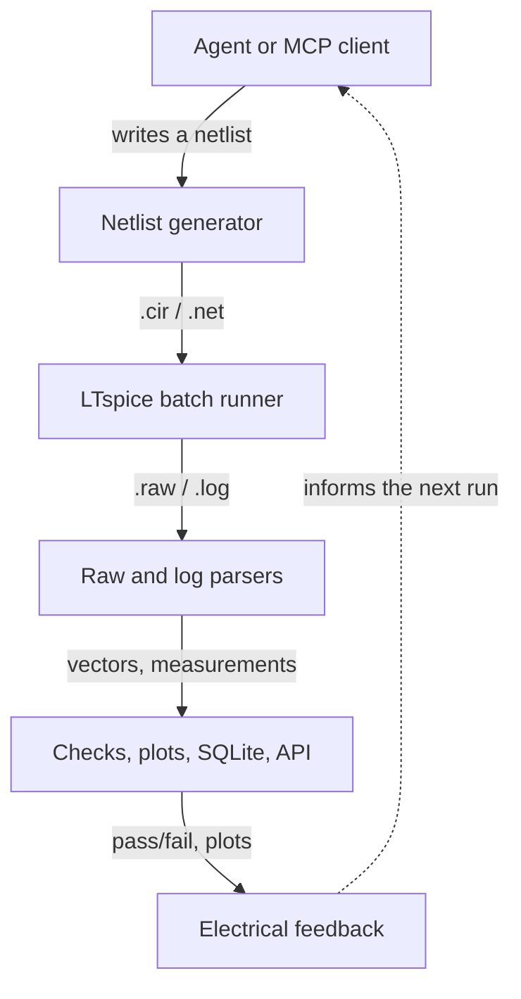
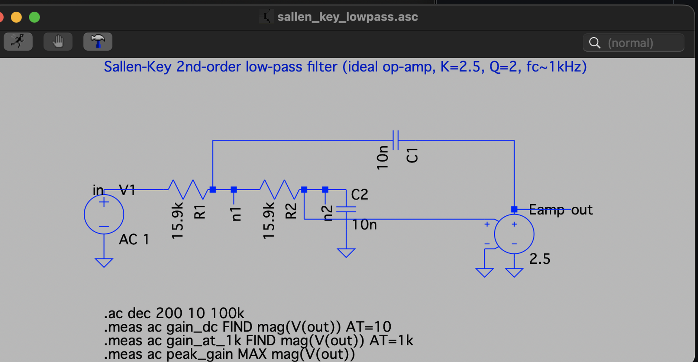
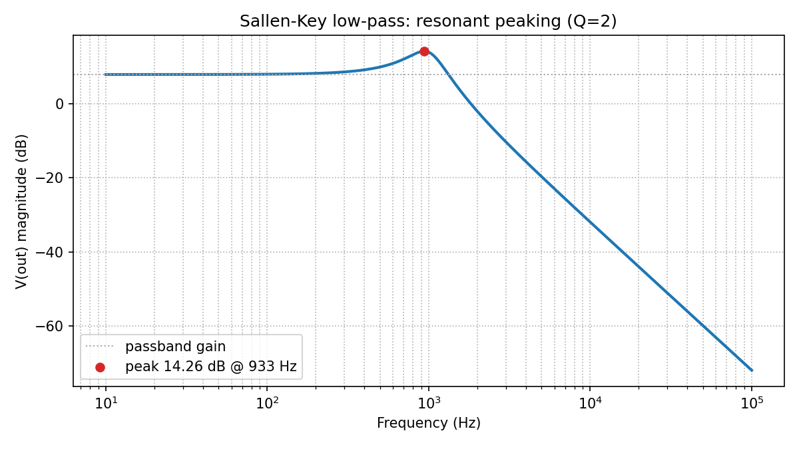
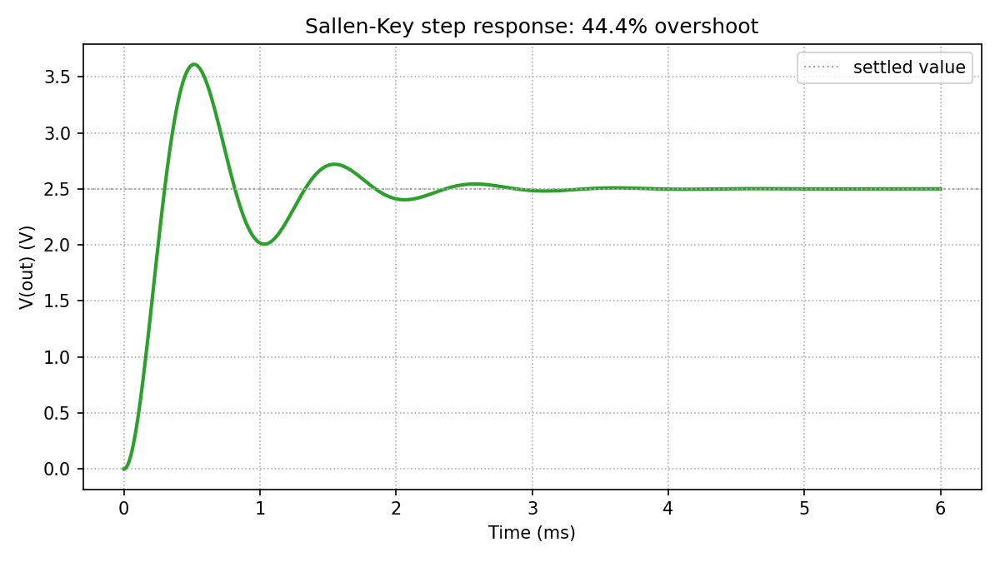

# LTspice Agent Automation

Python-controlled LTspice simulation, analysis, experiment history, and local
MCP and REST automation for agent-driven electronics workflows.

**[View this project on claude_projs →](https://claudeprojs.vercel.app/projects/ltspice-agent-automation)**

See [ROADMAP.md](ROADMAP.md) for the approved MCP development sequence,
cross-platform requirements, and portable mixed-signal DAQ/scope flagship.

The project treats text netlists (`.cir`/`.net`) as the reproducible execution
boundary while keeping the tooling useful alongside human-authored LTspice
schematics (`.asc`). It is designed to complement schematic and PCB automation
systems by providing measurable electrical feedback before and during board
design.

## What is included

- Cross-platform Python wrapper around LTspice batch mode
- Binary and ASCII `.raw` waveform parsing, CSV export, and plots
- `.meas` and native `.step` result extraction
- Parameter sweeps, Monte Carlo analysis, and target-response search
- Durable run manifests, SQLite history, and a static HTML dashboard
- An MCP server exposing the toolkit as native agent tools
- Local synchronous and asynchronous REST API
- Unit tests and small validation circuits, from a single-pole RC divider up
  to a resonant 2nd-order active filter

The included validation circuits are intentionally simple and generic: an AC
RC low-pass, a transient RC step response, a stepped RC response, a
transistor-level CMOS NAND, and a Sallen-Key 2nd-order active filter. They
validate the API and data pipeline without including any private design or
individual test-run artifacts.



## A first result

A Sallen-Key 2nd-order active low-pass filter, tuned to Q=2, produces
machine-checkable resonant peaking in its frequency response and underdamped
ringing in its step response — dynamics a single-pole RC circuit can't
exercise:







*Generated by `examples/analyze_sallen_key.py`. The same circuit also exists
as a real, GUI-editable LTspice schematic —
[`examples/sallen_key_lowpass.asc`](examples/sallen_key_lowpass.asc) — see
[LEARNINGS.md](LEARNINGS.md#schematic-compatibility) for how it was authored
and verified.*

## Run the example

From this directory:

```bash
python3 ltspice_wrapper.py
```

On macOS, the wrapper looks for the standard executable at:

```text
/Applications/LTspice.app/Contents/MacOS/LTspice
```

Override executable discovery when needed:

```bash
LTSPICE_EXECUTABLE=/path/to/LTspice python3 ltspice_wrapper.py
```

The core runner, parser, API, tests, CSV, JSON, SQLite, and HTML tooling use
only Python's standard library. Install the optional plotting dependency when
needed:

```bash
python3 -m pip install -r requirements.txt
```

Common workflows are also available through `make`: `make test`, `make ac`,
`make transient`, `make nand`, `make sallen-key`, `make sweep`,
`make monte-carlo`, `make search`, `make step`, and `make dashboard`.

Each run gets its own timestamped directory under `runs/`. LTspice writes the
simulation results there, including the `.raw` and `.log` files. Scalar `.meas`
results are also extracted from the log and printed. Every run includes a
`run_manifest.json` file containing the command, paths, netlist hash, options,
timing, status, and output file list.

## Run an existing netlist

```bash
python3 ltspice_wrapper.py path/to/Draft2.net
```

Use `--output-dir` when a stable output location is preferable:

```bash
python3 ltspice_wrapper.py examples/rc_lowpass.cir --output-dir runs/latest
```

Text netlists (`.cir`/`.net`) are the most portable automation boundary. The
wrapper can attempt `.asc` schematics, but older or version-specific schematic
files may require opening in LTspice and exporting/recreating a text netlist
before batch execution.

On macOS, validate the LTspice release itself before debugging the automation
layer. LTspice 26.0.2.1 failed during command-line startup on one Apple Silicon
Mac running macOS Tahoe, while the same wrapper and netlists passed with
LTspice 17.2.4. See [LEARNINGS.md](LEARNINGS.md#ltspice-26-on-macos-tahoe) for
the symptoms and recovery procedure.

For a text-readable raw file, especially for transient analysis:

```bash
python3 ltspice_wrapper.py examples/transient_rc.cir --ascii
```

## Run a parameter sweep

The included sweep varies resistance, runs six independent LTspice jobs, and
writes machine-readable results:

```bash
PYTHONPATH=. python3 examples/sweep_rc.py
```

Each sweep is stored under `runs/sweep-<timestamp>/`, with one `.raw` and `.log`
pair per circuit plus `results.csv` and `results.sqlite3` summaries.
Every sweep is also appended to `runs/history.sqlite3` for cross-run analysis.

## Analyze and plot waveforms

The analysis example parses the binary `.raw` file, exports all vectors to CSV,
creates a PNG frequency-response plot, and runs a pass/fail measurement check:

```bash
PYTHONPATH=. python3 examples/analyze_rc.py
```

See [LEARNINGS.md](LEARNINGS.md) for the verified command behavior, raw-file
format notes, and the current automation roadmap.

Sweep history is stored in SQLite at `runs/history.sqlite3`; the per-sweep
database remains alongside each sweep's CSV summary.

Print the accumulated history with:

```bash
PYTHONPATH=. python3 examples/history_report.py
```

## Analyze transient waveforms

The transient example exports the waveform, plots the output voltage, and
checks both `.meas` values and decoded raw-vector extrema:

```bash
PYTHONPATH=. python3 examples/analyze_transient.py
```

## Run the parser/check tests

```bash
python3 -m unittest discover -s tests -v
```

## Run a Monte Carlo analysis

The Monte Carlo example generates 24 deterministic component samples, runs one
LTspice simulation per sample, checks a gain window, exports CSV/SQLite data,
and creates a distribution plot:

```bash
PYTHONPATH=. python3 examples/monte_carlo_rc.py
```

## Run the CMOS NAND experiment

The NAND experiment drives a transistor-level 3.3 V CMOS NAND gate through all
four input combinations, compares its output against a behavioral reference,
and measures propagation delay:

```bash
PYTHONPATH=. python3 examples/analyze_nand.py
```

It writes a waveform CSV, transient plot, measurements, and manifest below
`runs/`. The generated artifacts are intentionally ignored by Git.

## Run the Sallen-Key filter example

The Sallen-Key example runs both an AC sweep and a step response for a
2nd-order active low-pass filter (ideal op-amp modeled as a fixed-gain
E-source, K=2.5, Q=2), checks the resonant peaking and overshoot against
closed-form predictions, and plots both domains:

```bash
PYTHONPATH=. python3 examples/analyze_sallen_key.py
```

The same circuit also ships as a real LTspice schematic —
[`examples/sallen_key_lowpass.asc`](examples/sallen_key_lowpass.asc) and
[`examples/sallen_key_step.asc`](examples/sallen_key_step.asc) — open either
in LTspice to view or edit it graphically. Simulation still runs from the
`.cir` netlist; see [LEARNINGS.md](LEARNINGS.md#schematic-compatibility) for
why `.asc` files aren't batched directly.


*`examples/sallen_key_lowpass.asc` open in the actual LTspice editor — hand-authored
from LTspice's own symbol library and pin geometry, not a drawing.*

## Search for a target response

The design-search example uses a logarithmic binary search to select resistance
for a target gain, preserving every trial as CSV, SQLite, PNG, and HTML:

```bash
PYTHONPATH=. python3 examples/design_search_rc.py
```

## Build a run dashboard

Index all runs that have manifests into static HTML and JSON:

```bash
python3 report_runs.py
```

Open [runs/index.html](runs/index.html) to browse statuses, measurements,
durations, and generated artifacts.

## Use native LTspice stepping

Native `.step` runs multiple parameter points in one LTspice invocation:

```bash
PYTHONPATH=. python3 examples/analyze_step_rc.py
```

The example detects step boundaries in the raw axis, parses the stepped
measurement table, and writes one CSV row per native step.

## Use the local REST API

Start the service in one terminal:

```bash
PYTHONPATH=. python3 api_server.py
```

Submit a netlist from another terminal:

```bash
PYTHONPATH=. python3 examples/api_client.py
```

Submit a longer transient job asynchronously and poll it:

```bash
PYTHONPATH=. python3 examples/api_async_client.py
```

The service exposes `GET /health`, `GET /runs`, `GET /jobs`, `GET /jobs/{job_id}`,
`POST /simulate`, and `POST /simulate/async`. The simulation endpoint accepts
JSON containing `netlist`, optional `filename`, optional `ascii`, and optional
`timeout`. The async endpoint returns a job ID immediately; poll its job URL
until the status is `completed` or `failed`. It binds to `127.0.0.1` by
default; do not expose it on a network interface without adding authentication
and authorization.

## Use the MCP server

`mcp_server.py` exposes the same automation surface as native tools over the
Model Context Protocol, in-process (no REST server needed): `run_netlist`,
`run_netlist_file`, `get_measurements`, `get_waveform`, `export_waveform_csv`,
`analyze_waveform`, `run_parameter_sweep`, `run_experiment`,
`define_experiment`, `start_experiment`, `get_experiment`,
`cancel_experiment`, `list_runs`, `build_dashboard`, and `list_examples`.

It depends on the `mcp` package. Homebrew/system Python is externally
managed, so install it into a local virtualenv:

```bash
python3 -m venv .venv
.venv/bin/pip install -r requirements-mcp.txt
```

Register it with Claude Code:

```bash
claude mcp add ltspice -- "$(pwd)/.venv/bin/python" "$(pwd)/mcp_server.py"
```

Or run it directly for any stdio MCP client:

```bash
.venv/bin/python mcp_server.py
```

Every run tool returns a `run_dir`; pass it to `get_measurements`,
`get_waveform`, or `export_waveform_csv` to pull results without re-running
the simulation. `get_waveform` downsamples by default (`max_points=200`) to
keep vectors small in an agent's context; request a higher `max_points` or
use `export_waveform_csv` for full resolution. This server has the same
trust model as the REST API: it runs LTspice locally with no sandboxing, so
only expose it to trusted agents.

### Run a structured experiment

Phase 2A adds synchronous, deterministic Cartesian experiments. Parameters are
ordered records; declaration order is significant, each value order is
preserved, and the first parameter changes slowest. Units are metadata only and
do not modify the rendered value. A parameter named `R` replaces every `{R}`
placeholder in the netlist template.

```json
{
  "netlist_template": "R1 in out {R}\nC1 out 0 {C}\n.ac dec 100 10 1Meg\n.end\n",
  "parameters": [
    {"name": "R", "values": ["1k", "2.2k"], "unit": "ohm"},
    {"name": "C", "values": ["10n", "22n"], "unit": "F"}
  ],
  "waveform_analyses": [
    {
      "name": "bandwidth",
      "variable": "V(out)",
      "requirements": [
        {"metric": "cutoff_frequency", "operator": ">=", "target": 1000,
         "reference_frequency": 10}
      ]
    }
  ]
}
```

Phase 2B-A adds optional derived parameters without evaluating Python or shell
expressions. Dependencies come from placeholders in each derived `template`,
are resolved in stable topological order, and do not increase the Cartesian
point count. Base parameters may be used only through a derived parameter:

```json
"derived_parameters": [
  {"name": "RC", "template": "({R})*({C})", "unit": "s"},
  {"name": "DOUBLE_RC", "template": "2*{RC}", "unit": "s"}
]
```

Forward references are allowed. Unknown dependencies, duplicate names, cycles,
and parameters that cannot affect the netlist are rejected before LTspice runs.
Returned point parameters and CSV columns contain resolved derived strings in
their original declaration order.

### Run a durable experiment job

The Phase 2B lifecycle keeps definition and execution separate. First call
`define_experiment` with the same definition accepted by `run_experiment`, plus
an optional `max_concurrency` from 1 through 4. The default is 2. Definition
validates and persists the experiment but does not launch LTspice. Then call
`start_experiment` with the returned `experiment_id`, and poll
`get_experiment` for `finished_points`, `pending_points`, `running_points`, and
the existing pass/error counts.

Experiment definitions, progress, and terminal point checkpoints are stored as
atomic UTF-8 JSON. A restarted MCP manager automatically requeues jobs that
were queued or running, skips valid `point_result.json` checkpoints, and places
an interrupted point's next execution in a fresh attempt directory. Final JSON
and CSV are always assembled in Cartesian index order, regardless of point
completion order.

`cancel_experiment` is idempotent and cooperative. It immediately cancels a
defined or queued job. For a running job it prevents new points from being
scheduled; already-running LTspice processes are allowed to finish so behavior
does not depend on Unix signals and remains portable to Windows. If cancellation
arrives before waveform analysis, that analysis is skipped. The terminal job
status is `cancelled`, and partial results remain available.

The file-backed manager intentionally supports one active MCP process per
`runs/` directory. Experiments are coordinated FIFO, while points within the
active experiment use the declared concurrency bound. Multi-process locking is
outside Phase 2B.

The portable experiment implementation lives in `experiment_engine.py`. It
owns definition validation, parameter expansion, durable state, checkpoints,
and result assembly without importing MCP. `mcp_server.py` provides the thin
LTspice execution and waveform-analysis adapter plus the public tool wrappers.
This boundary lets other Python front ends reuse the engine without running an
MCP server.

`run_experiment` remains the backward-compatible synchronous path. It validates
the complete definition before running, executes sequentially, and caps the
Cartesian product at 1,000 points. Requirements are
defined once and reused unchanged at every successful point. A failed
simulation or analysis is recorded without preventing later points from
running; a requirement miss remains a completed analysis with `all_passed`
false. Each experiment writes `experiment_manifest.json`, full `results.json`,
and a deliberately flat `results.csv` under a stable `point-0000`,
`point-0001`, ... directory layout.

`analyze_waveform` always evaluates the full parsed vector rather than the
downsampled agent payload. Requirements are structured metric/operator/target
objects, for example:

```json
[
  {"metric": "maximum", "operator": "<=", "target": 5.5},
  {"metric": "overshoot", "operator": "<=", "target": 5.0, "final_value": 5.0},
  {"metric": "settling_time", "operator": "<=", "target": 0.00002,
   "final_value": 5.0, "settling_tolerance": 0.02}
]
```

Each result includes units, pass/fail state, the threshold, metric parameters,
and point or region evidence. A stepped raw file requires `step_index`; the
tool splits on actual axis resets rather than assuming equal transient lengths.

Phase 1B adds closed, per-requirement `window_start`/`window_end` selection and
the `fall_time`, `pulse_width`, `duty_cycle`, `slew_rate`, `undershoot`,
`ripple`, `monotonicity`, `propagation_delay`, and
`forbidden_region_samples` metrics. Window evidence indexes remain relative to
the selected raw step, not the smaller window. Bounds between recorded samples
are linearly interpolated and retain both bracketing source indexes.

| Metric | Definition | Required parameters |
| --- | --- | --- |
| `fall_time` | First 90–10% falling transition | Falling `initial_value`/`final_value`, or falling window endpoints |
| `pulse_width` | First complete active pulse; `polarity` defaults to `high` | `threshold_value` |
| `duty_cycle` | Interpolated active time divided by window duration | `threshold_value` |
| `slew_rate` | Largest absolute adjacent slope | None |
| `undershoot` | Excursion beyond the initial endpoint, normalized to step size | Distinct step endpoints |
| `ripple` | Peak-to-peak value in the window | None |
| `monotonicity` | Largest adjacent reversal; zero is monotonic | `direction` only when endpoints are equal |
| `propagation_delay` | First secondary edge at or after the first primary edge | Secondary variable, two thresholds, and two edge directions |
| `forbidden_region_samples` | Recorded samples inside one band or simultaneous paired bands | `forbidden_min` and `forbidden_max` |

For paired checks, pass `secondary_variable` to `analyze_waveform`.
`propagation_delay` treats the primary `variable` as the trigger and measures
the first requested secondary edge at or after the first requested primary
edge; both thresholds and edge directions are explicit. A forbidden-region
requirement counts full-resolution samples inside the inclusive primary band
and, when secondary bounds are present, inside both bands simultaneously. A
requirement such as `{"metric": "forbidden_region_samples", "operator":
"<=", "target": 0, ...}` proves that no recorded sample violated the region.

Phase 1C adds frequency-domain requirements:

| Metric | Definition | Required parameters |
| --- | --- | --- |
| `frequency` | Average rate between first and last matching interpolated edges | `threshold_value`; `edge` defaults to `rising` |
| `spectral_peak` | Amplitude of the largest non-DC component in an explicit band | `frequency_min`, `frequency_max` |
| `thd` | RMS harmonics 2…N divided by the fundamental amplitude | `fundamental_frequency`; `maximum_harmonic` defaults to 5 |
| `ac_gain_db` | Log-frequency-interpolated gain | `frequency_value` |
| `cutoff_frequency` | First selected-direction crossing below reference gain by 3.0103 dB | `reference_frequency` |
| `peaking_db` | Peak gain minus gain at the reference frequency | `reference_frequency` |
| `gain_crossover_frequency` | Falling 0 dB loop-gain crossing | None |
| `gain_margin` | Negative gain at the falling odd-180° phase crossing | None |
| `phase_margin` | 180° plus phase at the falling 0 dB crossing | None |

Spectral analysis integrates the adaptive LTspice samples in time instead of
treating them as uniformly spaced. `spectral_peak` uses a Hann window and a
bounded frequency grid; `thd` uses the largest whole-cycle subwindow and an
explicit fundamental. Both reject requested content above the conservative
Nyquist limit implied by the largest recorded time gap. Resource limits cap a
spectral search at 4,096 bins and 5,000,000 point-frequency operations, and THD
at the 100th harmonic.

AC metrics use the complex primary vector, divided by `secondary_variable`
when supplied. Magnitude and unwrapped phase are interpolated in log frequency.
Stability metrics reject absent or multiple crossovers; narrow
`window_start`/`window_end` when a response legitimately contains several.
The default axis unit is inferred as `Hz` for a `frequency` vector and `s`
otherwise.

## Windows

Verified on Windows 11 with LTspice 26.0.2: the baseline test suite passed and
the RC AC example matched its closed-form prediction. Install with:

```powershell
winget install --id AnalogDevices.LTspice
```

Then launch LTspice once from the Start menu and answer the "Anonymously Share
LTspice Usage Data" prompt. Until it is answered, batch mode hangs with no
output and no error; see [LEARNINGS.md](LEARNINGS.md#windows-portability).

The wrapper checks the common install locations, including winget's per-user
default at `%LOCALAPPDATA%\Programs\ADI\LTspice\LTspice.exe`. Set
`LTSPICE_EXECUTABLE` only when the installation is somewhere else:

```powershell
$env:LTSPICE_EXECUTABLE = 'C:\Program Files\ADI\LTspice\LTspice.exe'
python ltspice_wrapper.py
```

The `make` targets default to `python3`, which on Windows resolves to the
Microsoft Store alias stub rather than an interpreter. Pass the interpreter
explicitly:

```powershell
make PYTHON=python test
```

The wrapper uses `subprocess` and `pathlib` rather than shell-specific command
strings. Model-library search paths and representative `.asc` files still need
verification on the target LTspice version.

## Project status

This is an experimental local automation bridge, not an official Analog
Devices product. Keep the REST service bound to loopback unless authentication
and authorization are added.
