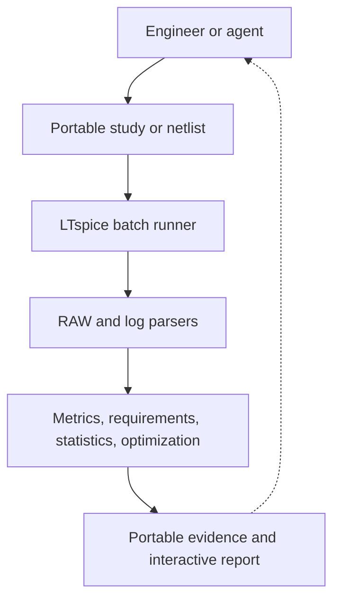

# LTspice Agent Automation

Python-controlled LTspice simulation, analysis, experiment history, and local
MCP, REST, and human-interface automation for electronics workflows.

## What this project does

This project does not replace LTspice. It turns LTspice into the trusted
numerical engine inside a larger engineering system. LTspice still solves the
circuit; this toolkit makes the work repeatable, measurable, searchable, and
reviewable.

```text
Experiment request → LTspice simulation → structured data → analysis → report
```

Around LTspice, the automation layer adds the capabilities needed for a
complete design-and-verification loop:

- Structured experiments instead of one-off manual runs
- Machine-evaluated electrical requirements instead of visual guesswork
- Corners, statistical yield, sensitivity, and boundary analysis
- Pareto optimization across competing design objectives
- Durable provenance, portable evidence, and human-first interactive reports

That changes the workflow from “run a simulation and inspect a waveform” into
“define what success means, explore the design space, find weak cases, select a
better design, and retain the evidence.” An engineer or AI agent can ask not
only what a circuit does, but whether it passes, where it fails, which variables
matter, and what tradeoff is best. Every conclusion remains connected to its
netlist, LTspice RAW data, measurements, and reproducible run record.

**[View this project on claude_projs →](https://claudeprojs.vercel.app/projects/ltspice-agent-automation)**

Text netlists (`.cir`/`.net`) are the reproducible execution boundary. The
tooling remains useful alongside human-authored LTspice schematics (`.asc`) and
complements schematic and PCB automation by providing measurable electrical
feedback before and during board design.

## What is included

- Cross-platform Python wrapper around LTspice batch mode
- Binary and ASCII `.raw` parsing, CSV export, plots, and waveform metrics
- `.meas` and native `.step` result extraction
- Parameter sweeps, statistical yield, boundary analysis, and optimization
- Durable manifests, restart recovery, verified caching, and HTML reports
- MCP server exposing the toolkit as native agent tools
- Local synchronous and asynchronous REST API
- **LTspice System Builder**, a local-only human interface for portable study
  definition, safe plan preview, local or explicitly authorized GitHub Windows
  execution, and engineering review
- Unit and acceptance tests covering circuits from an RC divider through a
  mixed-signal DAQ acquisition channel



See [ROADMAP.md](ROADMAP.md) for the approved development sequence,
cross-platform requirements, and mixed-signal DAQ/scope flagship.

## A first result

A Sallen-Key second-order active low-pass filter tuned to Q=2 produces
machine-checkable resonant peaking and underdamped ringing—dynamics a
single-pole RC circuit cannot exercise.

<p align="center">
  <a href="docs/images/sallen-key-schematic.png"></a>
</p>

<p align="center">
  <a href="docs/images/sallen-key-bode.png"></a>
</p>

<p align="center">
  <a href="docs/images/sallen-key-step.png"></a>
</p>

The previews are intentionally restrained; select one to inspect its full-size
source. They are generated by `examples/analyze_sallen_key.py`. The companion
GUI-editable schematic is
[`examples/sallen_key_lowpass.asc`](examples/sallen_key_lowpass.asc).

## Quick start

Install [LTspice](https://www.analog.com/en/resources/design-tools-and-calculators/ltspice-simulator.html),
then run the baseline RC example from the repository root:

```bash
python3 ltspice_wrapper.py
```

On macOS, the wrapper discovers:

```text
/Applications/LTspice.app/Contents/MacOS/LTspice
```

Override executable discovery when necessary:

```bash
LTSPICE_EXECUTABLE=/path/to/LTspice python3 ltspice_wrapper.py
```

Install optional plotting, MCP, GUI, and development dependencies in a local
virtual environment:

```bash
python3 -m venv .venv
.venv/bin/pip install -r requirements.txt -r requirements-mcp.txt \
  -r requirements-gui.txt -r requirements-dev.txt
```

Common commands include `make test`, `make ac`, `make transient`, `make nand`,
`make sallen-key`, `make mixed-signal-daq`, `make sweep`,
`make statistical-yield`, `make search`, `make step`, and `make dashboard`.
Every target has a `.venv/bin/python <script>.py`-style equivalent for
platforms without GNU Make installed (see [Windows](#windows) below).

## LTspice System Builder

System Builder gives a human the same deterministic study contracts used by the
MCP. It loads and saves portable `.ltstudy.json` recipes, edits manufacturing
variables and operating corners in engineering units, previews the exact
future immutable plan and simulation cost, and keeps execution behind a
separate explicit acknowledgement.

```bash
make system-builder
```

On Windows, skip that command — `make` is not a standard Windows tool — and
use `.\Start-SystemBuilder.cmd` instead; see the
[Windows guide](docs/WINDOWS.md) below.

The application opens on a random loopback-only `127.0.0.1` port. It supports
durable statistical and optimization jobs, cancel/resume recovery, native
LTspice schematic capture, completed-run decision views, and linked portable
evidence. Preview never publishes a plan or launches LTspice. A credential-free
GitHub workload preview can bind an unstarted frozen plan to a Windows target
and evidence contract. Remote execution is separately acknowledged, uses the
user's existing GitHub CLI login, and admits downloaded evidence only after its
manifest and SHA-256 hashes verify.

Read the [System Builder guide](docs/SYSTEM_BUILDER.md) for setup, security,
schematic capture, optimization, tolerance qualification, and recovery.
Windows users can either run the source launcher or download the verified
Python-free application bundle described in the [Windows guide](docs/WINDOWS.md).

## Common workflows

Detailed commands and behavior live in the
[workflow guide](docs/WORKFLOWS.md):

| Goal | Entry point |
| --- | --- |
| Run a netlist | `python3 ltspice_wrapper.py path/to/circuit.cir` |
| Analyze AC or transient data | `examples/analyze_rc.py`, `examples/analyze_transient.py` |
| Run statistical yield | `examples/statistical_rc_yield.py` |
| Exercise the validation circuits | `examples/analyze_nand.py`, `examples/analyze_sallen_key.py` |
| Run the mixed-signal DAQ study | `make mixed-signal-daq` |
| Search or optimize a design | `examples/design_search_rc.py`, `examples/optimize_mixed_signal_daq_durable.py` |
| Build the run dashboard | `python3 report_runs.py` |
| Inspect artifact retention | `python3 artifact_retention.py inspect` |
| Start the local REST API | `PYTHONPATH=. python3 api_server.py` |

Generated simulator data is written beneath `runs/` and intentionally ignored
by Git. Each accepted run retains a manifest with commands, paths, hashes,
timing, status, and artifact records.

## MCP server

`mcp_server.py` exposes simulation, waveform analysis, structured experiments,
statistical studies, optimization, durable orchestration, comparison, and
reporting as native Model Context Protocol tools. It runs in-process; no REST
server is required.

```bash
.venv/bin/python mcp_server.py
```

Register it with Claude Code:

```bash
claude mcp add ltspice -- "$(pwd)/.venv/bin/python" "$(pwd)/mcp_server.py"
```

Every run tool returns a `run_dir` that can be passed to measurement, waveform,
or CSV-export tools without rerunning LTspice. Waveforms are downsampled by
default for bounded agent context; full-resolution data remains in CSV and RAW
evidence.

See [docs/MCP_REFERENCE.md](docs/MCP_REFERENCE.md) for the complete inventory,
request schemas, validation rules, metric definitions, and examples. The MCP
and REST interfaces run trusted local LTspice processes without sandboxing and
should be exposed only to trusted clients.

## Windows

Windows is a first-class target. Install LTspice with `winget`, launch it once
to answer its usage-data prompt, and use `make PYTHON=python test` to avoid the
Microsoft Store `python3` alias. The wrapper discovers the standard winget and
Program Files locations.

After cloning the repository, `Start-SystemBuilder.cmd` provides the no-admin
first-start path: it creates the private Python environment, installs GUI
dependencies, diagnoses LTspice discovery, and opens the local interface. Pass
`-Workspace 'C:\path\to\your\projects'` to point it at your own circuit
projects instead of the repository's dogfooding examples — `.cmd` forwards
its arguments straight through to the underlying `.ps1`, so this works from
`cmd.exe`, PowerShell, or a double-click-launched shortcut with arguments.

The opt-in real-LTspice GitHub workflow installs a pinned Analog Devices build
on Windows Server, resolves first-run consent, and qualifies the RC, complete
mixed-signal DAQ, optimization, and finalist-tolerance paths with retained RAW,
JSON, CSV, manifest, and HTML evidence.

Read [docs/WINDOWS.md](docs/WINDOWS.md) for installation, troubleshooting,
workflow invocation, and verified cross-platform qualification results.

## macOS

Double-click `Start-SystemBuilder.command` (or run it from a terminal) for the
no-admin first-start path: it creates a private `.venv`, installs the GUI
dependencies, finds LTspice at `/Applications/LTspice.app`, and opens System
Builder in the default browser on a random loopback-only port. Install
LTspice first with `brew install --cask ltspice`, then launch it once to
answer its usage-data prompt. Pass `--workspace=/path/to/your/projects` from
a terminal to point it at your own circuit projects instead of the
repository's dogfooding examples.

## Tests and quality gates

Run the same local gates used by CI:

```bash
make lint
make typecheck
python3 -m unittest discover -s tests -v
```

Normal pushes run the suite on both macOS and Windows, but CI's Windows job
does not use `make` at all -- it calls the underlying commands directly, since
GNU Make is not a default part of Windows. Do the same locally instead of
installing `make`:

```powershell
python -m ruff check <files...>   # see LINT_FILES in the Makefile for the list
python -m mypy artifacts.py waveform_metrics.py frequency_domain_metrics.py
python -m unittest discover -s tests -v
```

Real LTspice installation and circuit qualification remain an explicit
workflow because they are slower and retain larger evidence bundles.

## Documentation

- [System Builder](docs/SYSTEM_BUILDER.md) — human study setup and execution
- [Simulation workflows](docs/WORKFLOWS.md) — examples, analysis, and retention
- [MCP reference](docs/MCP_REFERENCE.md) — agent-facing tool contracts
- [Windows setup and qualification](docs/WINDOWS.md) — native Windows path
- [Engineering learnings](LEARNINGS.md) — compatibility history and pitfalls
- [Roadmap](ROADMAP.md) — completed phases and planned work

## Project status

This is an experimental local automation bridge, not an official Analog Devices
product. Keep the REST service and System Builder bound to loopback unless
authentication and authorization are deliberately added.
