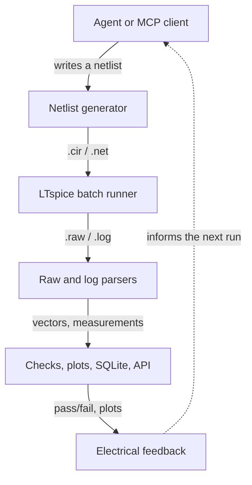

# LTspice Agent Automation

Python-controlled LTspice simulation, analysis, experiment history, and local
MCP and REST automation for agent-driven electronics workflows.

## What this project does

This project does not replace LTspice. It turns LTspice into the trusted
numerical engine inside a larger, agent-operated engineering system. LTspice
still solves the circuit; this toolkit makes the work repeatable, measurable,
searchable, and reviewable.

```text
Experiment request → LTspice simulation → structured data → analysis → report
```

Around LTspice, the MCP layer adds the capabilities needed for a complete
design-and-verification loop:

- Structured experiments instead of one-off manual runs
- Machine-evaluated electrical requirements instead of visual guesswork
- Corners, statistical yield, sensitivity, and boundary analysis
- Pareto optimization across competing design objectives
- Durable provenance, portable evidence, and human-first interactive reports

That changes the workflow from “run a simulation and inspect a waveform” into
“define what success means, explore the design space, find weak cases, select a
better design, and retain the evidence.” An engineer or AI agent can ask not
only what a circuit does, but whether it passes, where it fails, which variables
matter, and what tradeoff is best. Every conclusion remains connected to the
underlying netlist, LTspice RAW data, measurements, and reproducible run record.

**[View this project on claude_projs →](https://claudeprojs.vercel.app/projects/ltspice-agent-automation)**

See [ROADMAP.md](ROADMAP.md) for the approved MCP development sequence,
cross-platform requirements, and portable mixed-signal DAQ/scope flagship.

The project treats text netlists (`.cir`/`.net`) as the reproducible execution
boundary while keeping the tooling useful alongside human-authored LTspice
schematics (`.asc`). It is designed to complement schematic and PCB automation
systems by providing measurable electrical feedback before and during board
design.

## What is included

- Cross-platform Python wrapper around LTspice batch mode
- Binary and ASCII `.raw` waveform parsing, CSV export, and plots
- `.meas` and native `.step` result extraction
- Parameter sweeps, statistical yield analysis, and target-response search
- Durable run and experiment manifests, restart recovery, and a static HTML dashboard
- An MCP server exposing the toolkit as native agent tools
- Local synchronous and asynchronous REST API
- LTspice System Builder, a local-only human interface for portable study
  definition and safe plan preview
- Unit tests and small validation circuits, from a single-pole RC divider up
  to a resonant 2nd-order active filter

The included validation circuits are intentionally simple and generic: an AC
RC low-pass, a transient RC step response, a stepped RC response, a
transistor-level CMOS NAND, and a Sallen-Key 2nd-order active filter. They
validate the API and data pipeline without including any private design or
individual test-run artifacts.



## A first result

A Sallen-Key 2nd-order active low-pass filter, tuned to Q=2, produces
machine-checkable resonant peaking in its frequency response and underdamped
ringing in its step response — dynamics a single-pole RC circuit can't
exercise:


*Generated by `examples/analyze_sallen_key.py`. The same circuit also exists
as a real, GUI-editable LTspice schematic —
[`examples/sallen_key_lowpass.asc`](examples/sallen_key_lowpass.asc) — see
[LEARNINGS.md](LEARNINGS.md#schematic-compatibility) for how it was authored
and verified.*

## Run the example

From this directory:

```bash
python3 ltspice_wrapper.py
```

On macOS, the wrapper looks for the standard executable at:

```text
/Applications/LTspice.app/Contents/MacOS/LTspice
```

Override executable discovery when needed:

```bash
LTSPICE_EXECUTABLE=/path/to/LTspice python3 ltspice_wrapper.py
```

The core runner, parser, API, tests, CSV, JSON, SQLite, and HTML tooling use
only Python's standard library. Install the optional plotting dependency when
needed:

```bash
python3 -m pip install -r requirements.txt
```

Common workflows are also available through `make`: `make test`, `make ac`,
`make transient`, `make nand`, `make sallen-key`, `make mixed-signal-daq`,
`make sweep`, `make statistical-yield`, `make search`, `make step`, and
`make dashboard`.

## Preview a study with LTspice System Builder

System Builder is the browser-first human interface to the same deterministic
study contracts used by the MCP. It can load or save a portable
`.ltstudy.json` recipe, edit the sample count/seed/method, and preview the exact
future plan identity, corner expansion, and LTspice run count. Preview is pure:
it does not publish a plan, create a run directory, or start LTspice.

GUI-A2 adds a read-only workspace below the recipe preview. It reads current
durable-job progress directly from experiment manifests, reports whether the
rebuildable experiment index is current, and launches existing experiment,
optimization, and robust-selection HTML reports. Relative links from a report
to its JSON, CSV, RAW, manifest, and plan evidence remain available through a
session-protected, workspace-confined evidence route. Refresh never rebuilds an
index, resumes a job, or launches LTspice.

Install the optional GUI dependencies and launch the loopback-only application:

```bash
python3 -m pip install -r requirements-gui.txt
make system-builder
```

The application opens the default browser on a random `127.0.0.1` port. It
uses a session cookie, same-origin mutation checks, a strict content-security
policy, bounded JSON bodies, and workspace-confined regular inputs and
evidence. Remote execution remains disabled. The bundled reference recipe is
[`examples/mixed_signal_daq.ltstudy.json`](examples/mixed_signal_daq.ltstudy.json).

Its acceptance test proves that the human-authored DAQ recipe and the existing
agent-authored definition produce byte-identical statistical plans. The first
preview resolves 12 manufacturing samples across two ADC-load corners into 24
points and two paired experiments: 48 prospective LTspice runs.

Each run gets its own timestamped directory under `runs/`. LTspice writes the
simulation results there, including the `.raw` and `.log` files. Scalar `.meas`
results are also extracted from the log and printed. Every run includes a
`run_manifest.json` file containing the command, paths, netlist hash, options,
timing, status, output file list, and SHA-256/size records for generated
artifacts.

## Run an existing netlist

```bash
python3 ltspice_wrapper.py path/to/Draft2.net
```

Use `--output-dir` when a stable output location is preferable:

```bash
python3 ltspice_wrapper.py examples/rc_lowpass.cir --output-dir runs/latest
```

An explicit output directory must not already exist; the wrapper creates it
atomically. This prevents concurrent callers from sharing a directory and an older
RAW or log file from being mistaken for evidence from the current simulation.
Resolvable relative `.include`, `.inc`, and `.lib` references are rewritten in
the staged deck so they retain their source-directory meaning.

Text netlists (`.cir`/`.net`) are the most portable automation boundary. The
wrapper can attempt `.asc` schematics, but older or version-specific schematic
files may require opening in LTspice and exporting/recreating a text netlist
before batch execution.

On macOS, validate the LTspice release itself before debugging the automation
layer. LTspice 26.0.2.1 failed during command-line startup on one Apple Silicon
Mac running macOS Tahoe, while the same wrapper and netlists passed with
LTspice 17.2.4. See [LEARNINGS.md](LEARNINGS.md#ltspice-26-on-macos-tahoe) for
the symptoms and recovery procedure.

For a text-readable raw file, especially for transient analysis:

```bash
python3 ltspice_wrapper.py examples/transient_rc.cir --ascii
```

## Run a parameter sweep

The included sweep varies resistance, runs six independent LTspice jobs, and
writes machine-readable results:

```bash
PYTHONPATH=. python3 examples/sweep_rc.py
```

Each sweep is stored under `runs/sweep-<timestamp>/`, with one `.raw` and `.log`
pair per circuit plus `results.csv` and `results.sqlite3` summaries.
Every sweep is also appended to `runs/history.sqlite3` for cross-run analysis.

## Analyze and plot waveforms

The analysis example parses the binary `.raw` file, exports all vectors to CSV,
creates a PNG frequency-response plot, and runs a pass/fail measurement check:

```bash
PYTHONPATH=. python3 examples/analyze_rc.py
```

See [LEARNINGS.md](LEARNINGS.md) for the verified command behavior, raw-file
format notes, and the current automation roadmap.

Sweep history is stored in SQLite at `runs/history.sqlite3`; the per-sweep
database remains alongside each sweep's CSV summary.

Print the accumulated history with:

```bash
PYTHONPATH=. python3 examples/history_report.py
```

## Analyze transient waveforms

The transient example exports the waveform, plots the output voltage, and
checks both `.meas` values and decoded raw-vector extrema:

```bash
PYTHONPATH=. python3 examples/analyze_transient.py
```

## Run the parser/check tests

```bash
python3 -m unittest discover -s tests -v
```

## Run a production statistical yield analysis

The statistical RC example uses the same production API exposed over MCP. It
creates an immutable 24-sample scrambled-Halton plan with bounded Gaussian R/C
populations, runs one LTspice simulation per paired sample, evaluates a gain
window, and generates statistics, worst-case, sensitivity, CSV/JSON evidence,
and the offline HTML report. It does not maintain a second random sampler or
private SQLite schema:

```bash
PYTHONPATH=. python3 examples/statistical_rc_yield.py
```

### Resource ceilings

The production path rejects oversized work before it can become trusted
evidence: at most 1,000 statistical samples or expanded experiment points, 32
variables, 4 workers, 32 waveform analyses, and 256 requirements are accepted.
Each LTspice process has a 3,600-second maximum timeout. RAW parsing is limited
to 256 MiB, log parsing to 64 MiB, and generated artifacts from one accepted
run to 512 MiB. A successful process whose artifacts exceed that final ceiling
is recorded as failed before hashing or cache publication; cache entries over
the same ceiling fail integrity validation. The artifact ceiling is a
post-process acceptance guard, not an operating-system disk quota.

Offline reports embed at most 100 traces, 40,000 displayed waveform points, and
2,000 statistical analysis rows. Empirical CSV imports are separately limited
to 1 MB and 10,000 observations. These are validation limits, so malformed or
oversized studies cannot prevent the rebuildable index and dashboard from
isolating and reporting other valid experiments.

## Run the CMOS NAND experiment

The NAND experiment drives a transistor-level 3.3 V CMOS NAND gate through all
four input combinations, compares its output against a behavioral reference,
and measures propagation delay:

```bash
PYTHONPATH=. python3 examples/analyze_nand.py
```

It writes a waveform CSV, transient plot, measurements, and manifest below
`runs/`. The generated artifacts are intentionally ignored by Git.

## Run the Sallen-Key filter example

The Sallen-Key example runs both an AC sweep and a step response for a
2nd-order active low-pass filter (ideal op-amp modeled as a fixed-gain
E-source, K=2.5, Q=2), checks the resonant peaking and overshoot against
closed-form predictions, and plots both domains:

```bash
PYTHONPATH=. python3 examples/analyze_sallen_key.py
```

The same circuit also ships as a real LTspice schematic —
[`examples/sallen_key_lowpass.asc`](examples/sallen_key_lowpass.asc) and
[`examples/sallen_key_step.asc`](examples/sallen_key_step.asc) — open either
in LTspice to view or edit it graphically. Simulation still runs from the
`.cir` netlist; see [LEARNINGS.md](LEARNINGS.md#schematic-compatibility) for
why `.asc` files aren't batched directly.


*`examples/sallen_key_lowpass.asc` open in the actual LTspice editor — hand-authored
from LTspice's own symbol library and pin geometry, not a drawing.*

## Run the mixed-signal DAQ acquisition study

The portable-DAQ reference is a materially richer validation circuit than the
Sallen-Key filter. It combines a two-pole 1 MHz-class anti-alias path, gain and
output loading, a clocked analog switch, hold capacitor, ADC input capacitance,
and leakage. One immutable correlated scrambled-Halton plan drives both AC and
transient studies across named light/heavy ADC-load corners:

```bash
PYTHONPATH=. python3 examples/mixed_signal_daq_study.py
# or
make mixed-signal-daq
```

The AC contract checks passband gain, cutoff, and peaking. The transient
contract checks front-end settling, full-resolution track error, and hold
droop. Each run emits yield, Wilson intervals, worst evidenced cases, global
sensitivity, and interactive offline HTML. The DAQ reports place the schematic,
plain-language circuit and simulation context, and interactive plots first;
compact engineering units replace raw scientific notation, while complete
parameters and evidence remain in a collapsed appendix. The companion
`mixed_signal_daq_boundary.cir` isolates track duration so an adaptive study
can resolve the real pass/fail acquisition-time boundary without conflating
other tolerances.

Open [`examples/mixed_signal_daq.asc`](examples/mixed_signal_daq.asc) in
LTspice for the human-facing version of the acquisition channel. It uses stock
LTspice symbols, labeled functional blocks and nets, nominal parameter values,
and notes explaining the filter, buffer, ADC driver, sample/hold, ADC loading,
droop, and acquisition-error observer. The active schematic is the nominal
transient profile; a note identifies the source and clock changes used by the
companion AC study. Automation continues to run the `.cir` templates, and a
regression test keeps the schematic component/value inventory aligned with the
transient netlist.

## Search for a target response

The design-search example uses a logarithmic binary search to select resistance
for a target gain, preserving every trial as CSV, SQLite, PNG, and HTML:

```bash
PYTHONPATH=. python3 examples/design_search_rc.py
```

## Build a run dashboard

Index all runs that have manifests into static HTML and JSON:

```bash
python3 report_runs.py
```

Open [runs/index.html](runs/index.html) to browse statuses, measurements,
durations, and generated artifacts.

## Use native LTspice stepping

Native `.step` runs multiple parameter points in one LTspice invocation:

```bash
PYTHONPATH=. python3 examples/analyze_step_rc.py
```

The example detects step boundaries in the raw axis, parses the stepped
measurement table, and writes one CSV row per native step.

## Use the local REST API

Start the service in one terminal:

```bash
PYTHONPATH=. python3 api_server.py
```

Submit a netlist from another terminal:

```bash
PYTHONPATH=. python3 examples/api_client.py
```

Submit a longer transient job asynchronously and poll it:

```bash
PYTHONPATH=. python3 examples/api_async_client.py
```

The service exposes `GET /health`, `GET /runs`, `GET /jobs`, `GET /jobs/{job_id}`,
`POST /simulate`, and `POST /simulate/async`. The simulation endpoint accepts
JSON containing `netlist`, optional `filename`, optional `ascii`, and optional
`timeout`. The async endpoint returns a job ID immediately; poll its job URL
until the status is `completed` or `failed`. It binds to `127.0.0.1` by
default. The current server accepts only numeric `127.0.0.1`; an authenticated
network mode is intentionally outside this local bridge.

## Use the MCP server

`mcp_server.py` exposes simulation, waveform analysis, structured experiments,
statistical studies, optimization, durable orchestration, comparison, and
reporting as native Model Context Protocol tools, in-process with no REST server
required. See the [complete tool inventory](docs/MCP_REFERENCE.md#tool-inventory).

It depends on the `mcp` package. Homebrew/system Python is externally
managed, so install it into a local virtualenv:

```bash
python3 -m venv .venv
.venv/bin/pip install -r requirements-mcp.txt
```

Register it with Claude Code:

```bash
claude mcp add ltspice -- "$(pwd)/.venv/bin/python" "$(pwd)/mcp_server.py"
```

Or run it directly for any stdio MCP client:

```bash
.venv/bin/python mcp_server.py
```

Every run tool returns a `run_dir`; pass it to `get_measurements`,
`get_waveform`, or `export_waveform_csv` to pull results without re-running
the simulation. `get_waveform` downsamples by default (`max_points=200`) to
keep vectors small in an agent's context and always retains both endpoints;
responses are capped at 10,000 points. Use `export_waveform_csv` for full
resolution. This server has the same
trust model as the REST API: it runs LTspice locally with no sandboxing, so
only expose it to trusted agents.

## MCP capability map

The MCP surface grows from the same structured experiment contract rather than
adding separate simulation systems. It currently supports:

- Deterministic Cartesian and native-stepped experiments
- Derived parameters, measurement and waveform requirements, and pass/fail evidence
- Seeded statistical plans, named operating corners, yield, sensitivity, and boundary refinement
- Durable experiment jobs, cancellation, recovery, indexing, and comparison
- Deterministic coarse and local-refinement optimization with constraints,
  Pareto ranking, bounded provenance, and a selected candidate
- Paired finalist tolerance proof with named-corner joint yield, margins,
  sensitivity, deterministic selection rationale, and platform comparison
- Verified artifact caching, portable reports, dashboards, JSON, CSV, and RAW provenance

The full request schemas, examples, validation rules, report behavior, and metric
definitions live in [docs/MCP_REFERENCE.md](docs/MCP_REFERENCE.md).

The mixed-signal DAQ is the primary end-to-end qualification circuit. To run its
bounded optimization as one durable AC/transient study:

```bash
PYTHONPATH=. .venv/bin/python examples/optimize_mixed_signal_daq_durable.py
```

That study compares alias rejection against acquisition settling while enforcing
passband, bandwidth, peaking, tracking-error, and hold-droop constraints across
light and heavy ADC-load corners. The resulting coarse nominal selection is not
a manufacturing-yield proof; the Phase 3 statistical machinery provides that
robustness layer for optimization finalists.

Given a completed optimization study, generate and run a bounded local
Pareto-neighborhood refinement through the same durable AC/transient pipeline:

```bash
PYTHONPATH=. .venv/bin/python examples/refine_mixed_signal_daq.py \
  <optimization-study-id>
```

Close the optimization loop by applying the same deterministic manufacturing
population and ADC-load corners to the coarse and refined finalists:

```bash
PYTHONPATH=. .venv/bin/python examples/qualify_mixed_signal_daq_finalists.py \
  <coarse-study-id> <refined-study-id>
```

The Phase 4D evaluator pairs each AC point with the matching transient point;
a sample passes only if both analyses pass. Its concise report explains the
selection, compares nominal objectives and joint corner yield, summarizes
worst constraint margins and dominant rank sensitivities, and leaves detailed
RAW, JSON, CSV, manifest, and analysis links at the bottom. The default example
uses 32 scrambled-Halton samples per finalist at both load corners. This is
bounded engineering qualification evidence, not a production-yield guarantee.

## Windows

Verified on Windows 11 with LTspice 26.0.2: the baseline test suite passed and
the RC AC example matched its closed-form prediction. Install with:

```powershell
winget install --id AnalogDevices.LTspice
```

Then launch LTspice once from the Start menu and answer the "Anonymously Share
LTspice Usage Data" prompt. Until it is answered, batch mode hangs with no
output and no error; see [LEARNINGS.md](LEARNINGS.md#windows-portability).

The opt-in `Real LTspice Windows qualification` GitHub workflow performs the
same path on an ephemeral hosted runner without burdening every push. It
downloads the [official Analog Devices Windows installer](https://www.analog.com/en/resources/design-tools-and-calculators/ltspice-simulator.html),
pins version 26.0.2 and the complete MSI SHA-256, installs silently, explicitly
selects **No** in the first-run usage-data dialog, and then executes
`tests/real_ltspice_smoke.py`, `tests/real_ltspice_daq.py`, and
`tests/real_ltspice_optimization.py`, and
`tests/real_ltspice_robust_selection.py`. The RC smoke
requires a real 501-point RAW file, decoded `.meas` evidence, the expected
cutoff and gain, and a completed run manifest. The DAQ qualification runs the
complete shared 24-point AC and 24-point transient statistical studies and
fails closed unless both ADC-load corners pass without simulation or analysis
errors. Its uploaded evidence preserves the immutable point plan, all primary
RAW/log/run-manifest files, structured JSON/CSV analyses, and both interactive
HTML reports with their relative links intact. Evidence is retained for seven
days. Run it manually with:

```bash
gh workflow run ltspice-windows-real.yml --ref main
```

The first complete DAQ qualification, GitHub run
[`32969899223`](https://github.com/daveyJ-sgs/LTspice-Agent-Automation/actions/runs/32969899223),
passed on Windows Server 2025 with LTspice 26.0.2. It completed all 24 AC and
24 transient points with zero invalid evidence and 100% yield in both ADC-load
corners. Download the retained evidence while it is available with:

```bash
gh run download 32969899223
```

Phase 4B cross-platform run
[`33037990442`](https://github.com/daveyJ-sgs/LTspice-Agent-Automation/actions/runs/33037990442)
also passed on Windows Server 2025. It ran the frozen 16-candidate DAQ
optimization as 32 AC and 32 transient points with zero errors, selected the
same tolerance-aware Pareto design as macOS, and published comparison
`optimization-comparison-e0df542a44aa096a` with zero classification, Pareto,
selection, or objective mismatches. The largest settling-time difference
between LTspice 17.2.4 on macOS and 26.0.2 on Windows was 25.72 ns, inside the
plan's explicit 50 ns decision resolution.

Phase 4D real-Windows run
[`33080244673`](https://github.com/daveyJ-sgs/LTspice-Agent-Automation/actions/runs/33080244673)
completed the final coarse/refined tolerance proof with 256 primary RAW files
and 256 run manifests. Both finalists passed all 32 deterministic manufacturing
samples at both ADC-load corners. Comparison
`robust-selection-comparison-a8327f7e16d468e3` reported zero exact or numeric
mismatches and retained the coarse 65 Ω design on both platforms; the largest
settling difference was 26.25 ns against the declared 50 ns tolerance.

The dialog targeting is relative to its verified window bounds rather than
absolute screen coordinates, but the workflow intentionally fails closed if a
future LTspice release changes or does not close that consent window.

The wrapper checks the common install locations, including winget's per-user
default at `%LOCALAPPDATA%\Programs\ADI\LTspice\LTspice.exe`. Set
`LTSPICE_EXECUTABLE` only when the installation is somewhere else:

```powershell
$env:LTSPICE_EXECUTABLE = 'C:\Program Files\ADI\LTspice\LTspice.exe'
python ltspice_wrapper.py
```

The `make` targets default to `python3`, which on Windows resolves to the
Microsoft Store alias stub rather than an interpreter. Pass the interpreter
explicitly:

```powershell
make PYTHON=python test
```

The wrapper uses `subprocess` and `pathlib` rather than shell-specific command
strings. Model-library search paths and representative `.asc` files still need
verification on the target LTspice version.

## Project status

This is an experimental local automation bridge, not an official Analog
Devices product. Keep the REST service bound to loopback unless authentication
and authorization are added.
