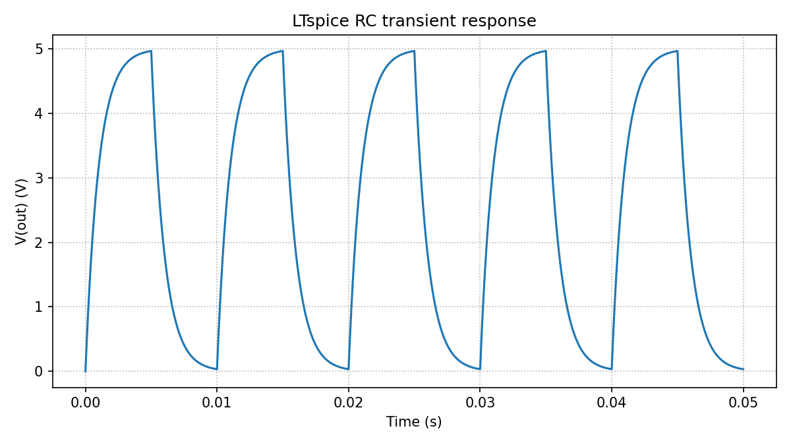

# LTspice Agent Automation

Python-controlled LTspice simulation, analysis, experiment history, and local
REST automation for agent-driven electronics workflows.

The project treats text netlists (`.cir`/`.net`) as the reproducible execution
boundary while keeping the tooling useful alongside human-authored LTspice
schematics (`.asc`). It is designed to complement schematic and PCB automation
systems by providing measurable electrical feedback before and during board
design.

## What is included

- Cross-platform Python wrapper around LTspice batch mode
- Binary and ASCII `.raw` waveform parsing, CSV export, and plots
- `.meas` and native `.step` result extraction
- Parameter sweeps, Monte Carlo analysis, and target-response search
- Durable run manifests, SQLite history, and a static HTML dashboard
- Local synchronous and asynchronous REST API
- Unit tests and small RC validation circuits

The included validation circuits are intentionally simple: an AC RC low-pass,
a transient RC step response, and a stepped RC response. They validate the API
and data pipeline without including any private design or individual test-run
artifacts.


## A first result

The included RC low-pass circuit produces a machine-checkable transient
response as well as the usual LTspice artifacts:



*RC transient response generated by the automation pipeline.*

## Run the example

From this directory:

```bash
python3 ltspice_wrapper.py
```

On macOS, the wrapper looks for the standard executable at:

```text
/Applications/LTspice.app/Contents/MacOS/LTspice
```

Override executable discovery when needed:

```bash
LTSPICE_EXECUTABLE=/path/to/LTspice python3 ltspice_wrapper.py
```

The core runner, parser, API, tests, CSV, JSON, SQLite, and HTML tooling use
only Python's standard library. Install the optional plotting dependency when
needed:

```bash
python3 -m pip install -r requirements.txt
```

Common workflows are also available through `make`: `make test`, `make ac`,
`make transient`, `make nand`, `make sweep`, `make monte-carlo`, `make search`,
`make step`, and `make dashboard`.

Each run gets its own timestamped directory under `runs/`. LTspice writes the
simulation results there, including the `.raw` and `.log` files. Scalar `.meas`
results are also extracted from the log and printed. Every run includes a
`run_manifest.json` file containing the command, paths, netlist hash, options,
timing, status, and output file list.

## Run an existing netlist

```bash
python3 ltspice_wrapper.py path/to/Draft2.net
```

Use `--output-dir` when a stable output location is preferable:

```bash
python3 ltspice_wrapper.py examples/rc_lowpass.cir --output-dir runs/latest
```

Text netlists (`.cir`/`.net`) are the most portable automation boundary. The
wrapper can attempt `.asc` schematics, but older or version-specific schematic
files may require opening in LTspice and exporting/recreating a text netlist
before batch execution.

On macOS, validate the LTspice release itself before debugging the automation
layer. LTspice 26.0.2.1 failed during command-line startup on one Apple Silicon
Mac running macOS Tahoe, while the same wrapper and netlists passed with
LTspice 17.2.4. See [LEARNINGS.md](LEARNINGS.md#ltspice-26-on-macos-tahoe) for
the symptoms and recovery procedure.

For a text-readable raw file, especially for transient analysis:

```bash
python3 ltspice_wrapper.py examples/transient_rc.cir --ascii
```

## Run a parameter sweep

The included sweep varies resistance, runs six independent LTspice jobs, and
writes machine-readable results:

```bash
PYTHONPATH=. python3 examples/sweep_rc.py
```

Each sweep is stored under `runs/sweep-<timestamp>/`, with one `.raw` and `.log`
pair per circuit plus `results.csv` and `results.sqlite3` summaries.
Every sweep is also appended to `runs/history.sqlite3` for cross-run analysis.

## Analyze and plot waveforms

The analysis example parses the binary `.raw` file, exports all vectors to CSV,
creates a PNG frequency-response plot, and runs a pass/fail measurement check:

```bash
PYTHONPATH=. python3 examples/analyze_rc.py
```

See [LEARNINGS.md](LEARNINGS.md) for the verified command behavior, raw-file
format notes, and the current automation roadmap.

Sweep history is stored in SQLite at `runs/history.sqlite3`; the per-sweep
database remains alongside each sweep's CSV summary.

Print the accumulated history with:

```bash
PYTHONPATH=. python3 examples/history_report.py
```

## Analyze transient waveforms

The transient example exports the waveform, plots the output voltage, and
checks both `.meas` values and decoded raw-vector extrema:

```bash
PYTHONPATH=. python3 examples/analyze_transient.py
```

## Run the parser/check tests

```bash
python3 -m unittest discover -s tests -v
```

## Run a Monte Carlo analysis

The Monte Carlo example generates 24 deterministic component samples, runs one
LTspice simulation per sample, checks a gain window, exports CSV/SQLite data,
and creates a distribution plot:

```bash
PYTHONPATH=. python3 examples/monte_carlo_rc.py
```

## Run the CMOS NAND experiment

The NAND experiment drives a transistor-level 3.3 V CMOS NAND gate through all
four input combinations, compares its output against a behavioral reference,
and measures propagation delay:

```bash
PYTHONPATH=. python3 examples/analyze_nand.py
```

It writes a waveform CSV, transient plot, measurements, and manifest below
`runs/`. The generated artifacts are intentionally ignored by Git.

## Search for a target response

The design-search example uses a logarithmic binary search to select resistance
for a target gain, preserving every trial as CSV, SQLite, PNG, and HTML:

```bash
PYTHONPATH=. python3 examples/design_search_rc.py
```

## Build a run dashboard

Index all runs that have manifests into static HTML and JSON:

```bash
python3 report_runs.py
```

Open [runs/index.html](runs/index.html) to browse statuses, measurements,
durations, and generated artifacts.

## Use native LTspice stepping

Native `.step` runs multiple parameter points in one LTspice invocation:

```bash
PYTHONPATH=. python3 examples/analyze_step_rc.py
```

The example detects step boundaries in the raw axis, parses the stepped
measurement table, and writes one CSV row per native step.

## Use the local REST API

Start the service in one terminal:

```bash
PYTHONPATH=. python3 api_server.py
```

Submit a netlist from another terminal:

```bash
PYTHONPATH=. python3 examples/api_client.py
```

Submit a longer transient job asynchronously and poll it:

```bash
PYTHONPATH=. python3 examples/api_async_client.py
```

The service exposes `GET /health`, `GET /runs`, `GET /jobs`, `GET /jobs/{job_id}`,
`POST /simulate`, and `POST /simulate/async`. The simulation endpoint accepts
JSON containing `netlist`, optional `filename`, optional `ascii`, and optional
`timeout`. The async endpoint returns a job ID immediately; poll its job URL
until the status is `completed` or `failed`. It binds to `127.0.0.1` by
default; do not expose it on a network interface without adding authentication
and authorization.

## Windows

The Python analysis, parsing, API, database, and reporting code is intended to
carry over to Windows. The wrapper checks common Windows install locations;
set `LTSPICE_EXECUTABLE` when the local installation uses another path:

```powershell
$env:LTSPICE_EXECUTABLE = 'C:\Program Files\ADI\LTspice\LTspice.exe'
python ltspice_wrapper.py
```

The wrapper uses `subprocess` and `pathlib` rather than shell-specific command
strings. Validate model-library search paths and representative `.asc` files
on the target LTspice version before relying on them in production.

The recommended first Windows check is to run `make test`, `make ac`, and
`make nand` with `LTSPICE_EXECUTABLE` explicitly set. Text-netlist execution,
waveform parsing, measurements, plots, SQLite history, and the local REST API
should be portable; executable discovery, model paths, `.asc` compatibility,
and simulator-version behavior still need to be verified on the laptop.

## Project status

This is an experimental local automation bridge, not an official Analog
Devices product. Keep the REST service bound to loopback unless authentication
and authorization are added.
